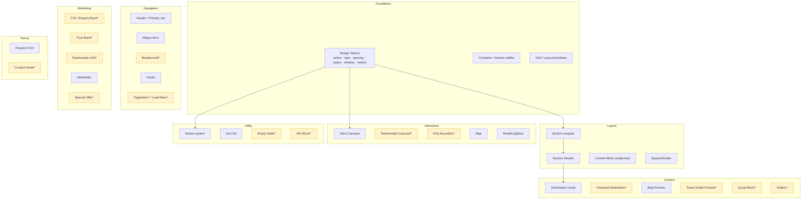
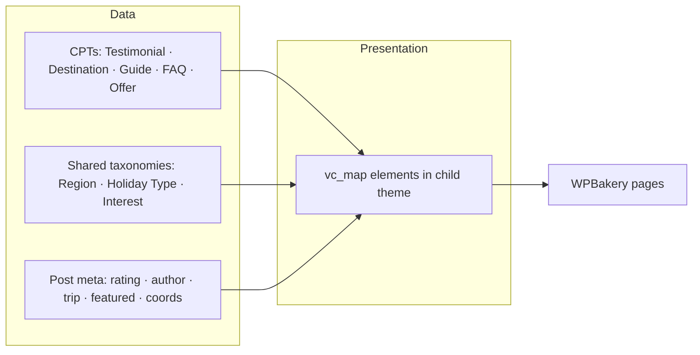
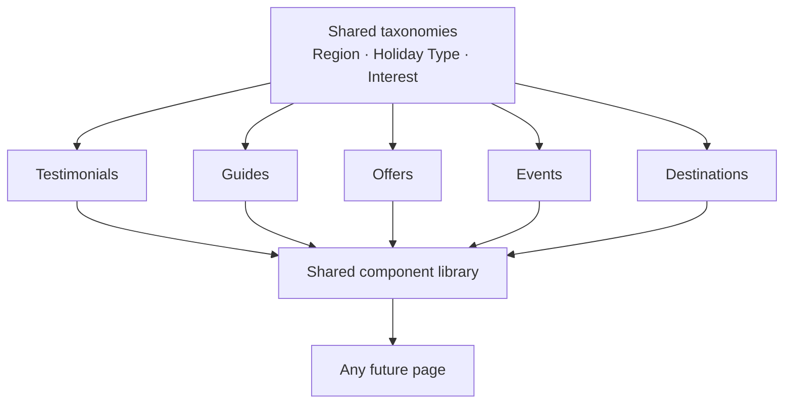
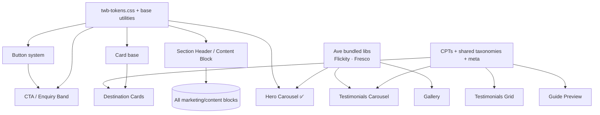

# Component Architecture & Reusable Design Audit — Travel Without Borders

The architectural reference for every future feature built in the **Ave child
theme**. It treats the site as a **design system**, inventories the reusable
interface patterns already present, and defines the future component library,
data strategy and development standards.

- **Audited:** 2026-06-26 · LocalWP · evidence = a site-wide WPBakery element census across all 87 published pages + 8 posts (1.06 MB of content).
- **Companions (do not duplicate):** [Design System Audit](DESIGN_SYSTEM_AUDIT.md) (tokens, type, colour, spacing) · [UX & IA Audit](UX_INFORMATION_ARCHITECTURE_AUDIT.md) (journey, IA, gaps, roadmap).
- **Scope:** documentation only — no code, WordPress or WPBakery changes; nothing implemented.
- **Reference implementation:** the existing `[twb_hero_carousel]` child-theme element is the **model** every recommendation builds on.
- **Architecture decisions:** see [ADR-001 — Testimonials Architecture](Architecture/ADR-001-Testimonials-Architecture.md), which records the decisions (CPT, shared taxonomies, WPBakery elements, Flickity reuse, `filemtime`, shared renderer, contextual queries, loader) that make Testimonials the **canonical template** for every future TWB component.

### Terminology (consistent across the planning docs)
- **Component** = full reusable unit (data + shared renderer + isolated assets + WPBakery element + docs).
- **Element** = the WPBakery `vc_map` registration / shortcode that presents a component.
- **Shared token layer** = `assets/css/twb-tokens.css`. **Shared card renderer** = the single render function reused by every element. **Loader** = `inc/loader.php`. **Trust Band** = component; `[twb_trust_stats]` = its element.

---

## How components are built today (the two realities)

1. **Ave/WPBakery elements** assembled in the page builder (`vc_*`, `ld_*`). This
   is ~99% of the site — pages are **hand-composed** from generic elements, so
   "components" exist as *recurring arrangements*, not named, reusable units.
2. **One true child-theme component:** `[twb_hero_carousel]` — a registered
   `vc_map` element with its own CSS/JS in `inc/` + `assets/`. This is the
   pattern the future library should follow.

**Implication:** most "components" today are **conventions, not code**. Rebuilding
them by hand on every page is the core source of duplication and slow page-building.

### Site-wide element census (evidence)

| Element | Uses | What it represents |
| ------- | ---- | ------------------ |
| `vc_column` / `vc_row` | 985 / 581 | Layout grid |
| `ld_spacer` | 649 | Vertical spacing |
| `vc_column_text` | 437 | Rich text |
| `vc_single_image` | 315 | Standalone image |
| `ld_fancy_heading` | 280 | Section/heading text |
| `vc_empty_space` | 182 | **Second** spacing element (duplicate of `ld_spacer`) |
| `ld_images_group_*` | 102 | Image group / mini-gallery |
| `ld_button` | 100 | Buttons/CTAs |
| `ld_content_box` | 96 | Generic content card/block |
| `ld_icon_box` | 87 | Icon + text |
| `ld_carousel` | 64 | Ave native carousel |
| `vc_gmaps` | 53 | **Google Maps embeds** (destination pages) |
| `vc_separator` | 41 | Divider rule |
| `vc_tta_*` | 5 | Tabs / accordion (barely used) |
| `ld_blog` | 2 | Blog grid |
| `ld_newsletter` / `ld_modal_window` / `vc_video` | 1 each | Newsletter / modal / video (mostly demo) |
| **`twb_hero_carousel`** | 1 | **Our custom child-theme element** |

---

## 1. Existing component inventory

> "Reusability today" = how reliably this pattern is reused as-is. ★ = ad-hoc hand-build, ★★★★★ = a single reusable unit.

| Component | Purpose | Pages used | Variations | Strengths | Weaknesses | Reusability today |
| --------- | ------- | ---------- | ---------- | --------- | ---------- | ----------------- |
| **Hero carousel** (`twb_hero_carousel`) | Premium homepage hero | Home | 1 | Tokenised, a11y, perf, client-editable | Single instance so far | ★★★★★ |
| **Intro / two-column text+image** | "Who we are" / lead section | Home, Tailor-made, region pages | layout mirrored L/R; offsets vary | Familiar, flexible | Hand-built each time; spacing varies | ★★ |
| **Section header** (`ld_fancy_heading` + `vc_separator`) | Titles + yellow rule | Everywhere (280×) | size/colour/highlight variants | On-brand | Re-styled per instance via inline CSS | ★★ |
| **Content block** (`ld_content_box`) | Generic grouped block / feature | Home, destinations (96×) | many | Flexible | Overloaded; no consistent treatment | ★★ |
| **Destination / tour cards** (`.fancy-box`) | Browse destinations | Destinations, regions | heading-sm variants | Clean grid, hover shadow | Square/flat; built via theme element + custom CSS | ★★★ |
| **Image group / mini-gallery** (`ld_images_group`) | Decorative image clusters w/ reveal | Home, destinations (102×) | effects on/off | Motion adds polish | Not a true lightbox gallery | ★★ |
| **Ave carousel** (`ld_carousel`) | Rotating cards (interests/events) | Home, landings (64×) | many configs | Native, flexible | Inconsistent controls vs hero | ★★★ |
| **Blog preview grid** (`ld_blog`) | Latest articles | Home, Blog | classic-2 style | Auto-pulls posts | Flat cards; no end CTA | ★★★★ |
| **Icon box** (`ld_icon_box`) | Contact details / features | Home, contact (87×) | side/stacked | Compact | Mixed icon libraries | ★★★ |
| **Buttons** (`ld_button`) | Actions | Everywhere (100×) | solid pill / underlined / naked / text | Covers needs | **No single primary**; inconsistent | ★★ |
| **Contact / enquiry form** (Quform) | Capture enquiries | Contact, Tailor-made | 1–2 | Functional | Off-brand defaults; only on 2 pages | ★★ |
| **Maps** (`vc_gmaps`) | Locate destinations | Destination pages (53×) | per-place embed | Useful context | Heavy embeds; no lazy/consent pattern | ★★★ |
| **Primary navigation / header** | Wayfinding | All | desktop + mobile | Mega-menu depth | Overflow at desktop; not sticky (see UX audit) | ★★★★ (template) |
| **Footer** | Secondary nav + blog + legal | All | 1 | Comprehensive | Dead links; dark/low-contrast | ★★★★ (template) |
| **Tabs / accordion** (`vc_tta`) | Toggled content | A few pages (5×) | tabs + section | Available | Barely used; not standardised | ★ |
| **Newsletter / Modal / Video** | Misc | Demo `/services/`, isolated | 1 each | — | Mostly leftover demo | ★ |
| **Spacers** (`ld_spacer` + `vc_empty_space`) | Vertical rhythm | Everywhere (831×) | px values vary | — | **Two elements for one job**; arbitrary values | ★ |

**Not present today (gaps for the library):** breadcrumb, Trust Band, testimonials, FAQ accordion (as a named component), CTA/enquiry band, quote block, featured destination, pagination/load-more, empty state, styled 404.

---

## 2. Duplicate components (consolidation targets)

| Duplication | Evidence | Consolidate into |
| ----------- | -------- | ---------------- |
| **Two spacing elements** | `ld_spacer` (649) **and** `vc_empty_space` (182) used interchangeably with arbitrary px | One **spacing token scale** (8/16/24/32/48/64/80) applied via shared classes; pick one element convention |
| **Multiple button styles, no primary** | `ld_button` in solid-pill / underlined / naked / text (100×) | One **Button system** with defined `primary / secondary / text` variants + tokens |
| **Repeated two-column intro** | Hand-built on Home, Tailor-made, regions with differing offsets/spacing | One **Content Block (media + text)** component with `imageSide` option |
| **Section title + rule** | `ld_fancy_heading` + `vc_separator` re-styled inline 280× | One **Section Header** component (title, eyebrow, rule, alignment) |
| **Carousels with different controls** | `ld_carousel` (Ave) vs `twb_hero_carousel` (custom) — different arrows/dots/animation | Standardise new carousels on the **hero's interaction language** (Flickity + tokens) |
| **Card variants** | `.fancy-box` tour cards vs `ld_content_box` blocks vs blog cards — all "card-ish", all different | A small **Card family** (Destination / Content / Blog) sharing radius, shadow, hover tokens |
| **CTA treatments** | Inline "Contact us", "Enquire Now", "Learn More", green email strip — all bespoke | One **CTA / Enquiry Band** component |

**Principle:** *one job → one component, with options* — variations become
**props/params**, not new hand-builds.

---

## 3. Component hierarchy

`*` (amber) = **does not exist yet** — proposed for the library (Section 4).

---

## 4. Future component library (purpose only — not designed here)

| Component | Category | Purpose | Exists? |
| --------- | -------- | ------- | ------- |
| **Hero** | Interactive | Static single-image hero (lighter than carousel) for inner pages | ❌ |
| **Hero Carousel** | Interactive | Rotating premium hero (homepage) | ✅ `twb_hero_carousel` |
| **Section Header** | Layout | Consistent title + eyebrow + rule + alignment | ◑ (ad-hoc) |
| **Content Block** | Layout | Media + text, configurable side; the reusable "intro/two-column" | ◑ (ad-hoc) |
| **Trust Band** (element `[twb_trust_stats]`) | Marketing | "30+ years · fully protected · 60+ destinations" credibility strip | ❌ |
| **Testimonials Carousel** | Marketing | Rotating quotes (homepage/landings) | ❌ |
| **Testimonials Grid** | Marketing | Multiple quotes (testimonials page) | ❌ |
| **Quote Block** | Content | Single highlighted testimonial inline | ❌ |
| **Destination Cards** | Content | Browse destinations (replaces ad-hoc `.fancy-box`) | ◑ |
| **Featured Destination** | Content | Large promoted destination unit | ❌ |
| **CTA / Enquiry Banner** | Marketing | The reusable "enquire" band for the journey's dead-ends | ❌ |
| **Gallery** | Content | True lightbox gallery (uses Fresco already bundled) | ◑ |
| **FAQ Accordion** | Interactive | Q&A blocks (also SEO) | ◑ (`vc_tta`, unstandardised) |
| **Travel Guide Preview** | Content | Promote guides distinct from blog | ❌ |
| **Blog Preview** | Content | Latest/related articles | ✅ `ld_blog` |
| **Newsletter** | Marketing | Email capture | ◑ (`ld_newsletter`, demo only) |
| **Contact Panel** | Forms | Reusable enquiry form + reassurance + trust | ◑ (Quform, per-page) |
| **Breadcrumb** | Navigation | Orientation on deep pages | ❌ |
| **Section Divider** | Layout | Standardised separator (one element + tokens) | ◑ |
| **Pagination / Load More** | Navigation | Lists (blog, future testimonials/guides) | ❌ |
| **Empty State** | Utility | "No results" for filtered lists | ❌ |
| **404 Block** | Utility | On-brand not-found with helpful routes | ❌ |

✅ exists · ◑ exists ad-hoc/partial · ❌ to build

---

## 5. WPBakery integration strategy

**Goal: minimise editor complexity** — the client builds pages from a small set
of clearly-named blocks, not dozens of raw elements.

### Build approach per component

| Build as a **custom `vc_map` element** (logic/data/interaction) | Assemble from **standard rows/columns** (pure layout) |
| --- | --- |
| Hero Carousel ✅ · Testimonials Carousel/Grid · Trust Band · Destination Cards (queried) · FAQ Accordion · CTA Banner · Breadcrumb · Travel Guide Preview · Featured Destination · Gallery · Contact Panel | One-off marketing rows · bespoke editorial layouts · simple two-column text (until Content Block exists) |

**Rules of thumb:**
- **Dynamic data or interaction → custom element.** Anything that queries posts
  (testimonials, destinations, guides) or carries JS belongs in `inc/` as a
  registered element, like the hero.
- **Pure static layout → rows/columns** with shared classes — don't over-engineer.
- **Category grouping:** register all custom elements under the existing
  **"Travel Without Borders"** WPBakery category so they're easy to find.

### Shared options (define once, reuse on every element)
A common param group every TWB element exposes:
- **Spacing:** top/bottom section padding from the **token scale** (not free px).
- **Background:** white / surface `#F7F7F7` / green / image.
- **Container width:** boxed (default) / full-bleed.
- **Heading set:** eyebrow + title + intro (delegates to Section Header).
- **Alignment**, **anchor id**.

### Shared styling hook
Every element outputs a root class (`twb-<name>`) and inherits tokens (Section 6),
so styling is centralised, not per-instance inline CSS.

---

## 6. Shared styling strategy

The Design System Audit already defines the **token values**. Architecturally,
those tokens should live in **one shared stylesheet** that every component
inherits — so a single change propagates everywhere.

| Shared layer | What it holds | How components inherit |
| ------------ | ------------- | ---------------------- |
| **`tokens` (CSS custom properties)** | colour, type scale, spacing scale, radius, shadow, motion (durations/easing), container widths | Defined on `:root`/`.twb-scope`; components reference `var(--twb-*)` (hero already uses `--twb-green` etc.) |
| **Base/utilities** | section padding helpers, container, button system, card base, heading styles, focus-ring, reduced-motion | Components add a base class; no re-declaring values |
| **Component CSS** | only what's unique to that component | One file per component under `assets/css/` |

**Standards for future components:**
- **No inline/per-instance CSS** for repeatable values — use tokens + utilities.
- **One spacing scale** (8/16/24/32/48/64/80) replaces arbitrary `ld_spacer`/`vc_empty_space` px.
- **One button system**, one card base, one motion vocabulary (carry the hero's `cubic-bezier(0.4,0,0.2,1)` + 250–350 ms).
- **Container/section widths** standardised (boxed ~1170px; full-bleed scrollbar-safe pattern from the hero).
- Honour **`prefers-reduced-motion`** and **`:focus-visible`** everywhere (hero is the template).

> Recommended shared file (future): `assets/css/twb-tokens.css` enqueued before
> component styles. **Not created in this task.**

---

## 7. Data strategy

Where each component's content should live, optimised for scale and client editing.

| Source | Best for | Trade-off |
| ------ | -------- | --------- |
| **WPBakery content** | One-off page copy, bespoke marketing sections, CTA bands | Not reusable across pages; editor-owned |
| **Custom Post Types (CPT)** | Repeating, queryable records: **Testimonials, Destinations, Travel Guides, FAQs, Special Offers, Events** | Needs registration + admin UI |
| **Taxonomies** | Cross-cutting filters: **Region, Holiday Type, Special Interest** shared across CPTs | Plan the shared vocabulary up front |
| **Post Meta** | Per-record fields (rating, author, trip date, featured flag, map coords) | Use a fields layer (ACF or hand-rolled) |
| **Theme Options** | Global, site-wide values (brand phone/email, default CTA text, social) | Not per-page |
| **Shortcodes / vc_map** | The *presentation* layer that **queries** the above | Keep logic thin |
| **Dynamic queries (`WP_Query`)** | Lists/feeds: latest/related/filtered testimonials, destinations, guides | Mind performance (cache where needed) |

**Recommended model:** **CPT + shared taxonomies + a thin `vc_map` presentation
layer.** Content authors manage *records*; page-builders **drop a component and
choose filters** (e.g. "Testimonials where Region = Bavaria, Featured first").
This is what makes contextual reuse (Section 8) possible without duplication.

---

## 8. Testimonials architecture (recommended — not implemented)

Directly addresses the UX audit's #1 priority. Designed for **contextual reuse**,
not a single static page.

### Storage
- **CPT `twb_testimonial`** — fields (post meta): author name, location, **trip type**, **destination/region**, **rating (1–5)**, date/quarter, source (on-site/Google/Feefo), **`featured` flag**, optional photo.
- Body = the quote.

### Categories & tags (shared taxonomies)
- **`twb_region`** — Bavaria, Black Forest, Rhine/Mosel, etc. *(shared with future Destination CPT so a quote can attach to a place).*
- **`twb_holiday_type`** — Tailor-made, Groups, Special Interest, Events, Couples, Family… *(shared cross-site axis the UX audit recommended).*
- **`twb_interest`** — Castles, Wine, History, Football… (optional).

### Featured testimonials
- `featured` meta → surfaced in the homepage band and as "default" quotes where no contextual match exists.

### Integration points (one CPT, many surfaces — via filters on the presentation element)
| Surface | Component | Query |
| ------- | --------- | ----- |
| Homepage | Trust Band + Testimonials Carousel | `featured = true`, limit 3–5 |
| Testimonials page | Testimonials Grid + filters | all, paginated |
| Destination/region page | Quote Block / mini-carousel | `region = <this page>` → fallback featured |
| Holiday-type page (Tailor-made/Groups) | Quote Block | `holiday_type = <this>` |
| Contact | Quote Block beside form | featured |
| Footer | rotating single quote | featured |

### Filtering / searching / pagination (future)
- **Filtering:** by region / holiday type taxonomy (front-end facets on the testimonials page).
- **Searching:** keyword across quote + author.
- **Pagination / Load More:** standard list component (Section 4) — build once, reuse for testimonials, guides, blog.

### Component split
- **Testimonials Carousel** (Interactive) — reuse hero's Flickity + tokens.
- **Testimonials Grid** (Marketing) — paginated/filterable.
- **Quote Block** (Content) — single inline quote for contextual pages.

> **Do not implement here.** This defines the architecture the Testimonials build task will follow.

---

## 9. Scalability assessment

Can the proposed library + data model absorb the roadmap **without redesign**?

| Future addition | Supported by | Redesign needed? |
| --------------- | ------------ | ---------------- |
| **Testimonials** | CPT + taxonomies + 3 components | No |
| **Travel Guides** | CPT `twb_guide` + `twb_region`/`type` + Guide Preview + list/pagination | No |
| **Blog** | Existing posts + Blog Preview + (add categories) | No |
| **Special Offers** | CPT `twb_offer` + Offer/CTA components | No |
| **Customer Stories** | Long-form variant of Testimonial CPT (or its own CPT) | No |
| **FAQs** | CPT `twb_faq` (or taxonomy-grouped) + FAQ Accordion | No |
| **Holiday Types** | `twb_holiday_type` taxonomy as a **second nav axis** + landing template | No (planned axis) |
| **Events** | CPT `twb_event` + cards + dates + map | No |
| **Destination Landing Pages** | Destination CPT (or existing pages) + Destination Cards + Featured Destination + CTA + Map + contextual testimonials | No |

**Verdict:** the **CPT + shared-taxonomy + thin presentation-element** model
scales cleanly. The key enabler is defining **shared taxonomies (Region, Holiday
Type) once**, so every future content type plugs into the same axes and every
component can filter by them — this is what prevents future redesign churn.

---

## 10. Development standards

Conventions to keep the child theme maintainable for years. (Workflow itself —
junction + Git single source of truth — is in
[Local Development Workflow](LOCAL_DEV_WORKFLOW.md).)

### CSS naming
- **BEM with `twb-` prefix**, as the hero already does:
  `block__element--modifier` → `.twb-hero__caption`, `.twb-testimonials__item--featured`.
- Reference **tokens** (`var(--twb-*)`); never hard-code repeatable values.
- One component → one stylesheet; shared values live in `twb-tokens.css` / base utilities.
- No inline CSS unless genuinely unavoidable.

### PHP organisation
- One file per concern in **`inc/`** (one per component + dedicated data files), each:
  registers its `vc_map`, defines its render callback, registers/enqueues its
  assets **on demand** (as the hero does).
- **Loader:** `functions.php` does a single `require_once inc/loader.php`; the
  **loader contains explicit `require_once` statements in dependency order** (not a
  glob/loop). This gives deterministic loading, easier debugging, predictable
  dependencies, fewer merge conflicts, and easier onboarding — so adding a
  component is one line in `loader.php` and `functions.php` is never re-touched.
  See [ADR-001 §D9](Architecture/ADR-001-Testimonials-Architecture.md).
- `functions.php` stays thin: requires the loader, registers shared assets (incl.
  the **shared token layer**), **`filemtime` versioning**.
- Data layer (CPTs, taxonomies, meta) in dedicated files (`inc/cpt-*.php`, `inc/taxonomies.php`).
- **Shared card renderer:** repeated card markup lives in one render function reused by every element — never duplicated.
- Escape on output, sanitise on input; PHP 7.4-compatible.

### JavaScript organisation
- One small script per interactive component in **`assets/js/`**; **reuse Ave's
  bundled libraries** (Flickity, Fresco) — no new dependencies.
- Guard against double-init and ensure single instances (hero pattern).
- Vanilla JS / progressive enhancement; no framework.

### Template files & assets
- Components are **WPBakery elements**, not page templates, wherever possible
  (keeps everything client-editable).
- Assets under `assets/css/` and `assets/js/`, one file per component + shared
  base; images/icons under `assets/`.

### Documentation
- Each component documented (purpose, params, data source, dependencies) — extend
  this audit or a future `COMPONENTS.md`.
- Update the relevant docs **in the same change** (per CONTRIBUTING).

### Version control & contributors
- Single source of truth = `07_Source/Themes/ave-child/` (junctioned to LocalWP).
- Branch per feature; small, scoped commits; keep `CHANGELOG` / `DEVELOPMENT_LOG` current.
- New contributors start from: [Contributing](../CONTRIBUTING.md) → [Local Dev Workflow](LOCAL_DEV_WORKFLOW.md) → this audit → the three audits.

### "Definition of a TWB component"
A component is library-ready when it: ① is a registered `vc_map` element under the
TWB category, ② uses tokens + base utilities (no inline CSS), ③ exposes the shared
options (spacing/background/container/heading), ④ sources data per Section 7,
⑤ reuses bundled JS libs with single-init, ⑥ meets the hero's a11y/perf bar, and
⑦ is documented.

---

## Dependency overview

Everything depends on **tokens**; data components depend on the **CPT/taxonomy
layer**; interactive ones reuse **Ave's bundled JS**. Build order follows the
arrows: tokens & base first, then shared blocks, then data + data-driven components.

---

## Implementation roadmap (sequence, not schedule)

| Phase | Build | Unlocks |
| ----- | ----- | ------- |
| **0 — Foundation** | `twb-tokens.css` + base utilities + Button/Card base; consolidate spacing scale | Consistency for everything after |
| **1 — Layout primitives** | Section Header · Content Block · Section Divider | Faster page assembly; kills the two-column duplication |
| **2 — Conversion** | CTA / Enquiry Band · Trust Band · Breadcrumb | Fixes UX-audit dead-ends + trust gaps |
| **3 — Data layer** | Testimonial CPT + shared taxonomies (Region, Holiday Type) | Foundation for contextual reuse |
| **4 — Testimonials** | Testimonials Carousel · Grid · Quote Block | UX-audit priority #1 |
| **5 — Content types** | Guides · FAQs · Offers · Destination Cards (queried) + list/pagination/empty-state | Scales the site; reuses the same library |
| **6 — Polish** | Gallery · 404 Block · Newsletter (on-brand) | Rounds out the system |

---

> Architectural reference only — no components designed, no code written, nothing
> on the site changed. Update as components are built so this remains the source
> of truth for the child-theme component system.
