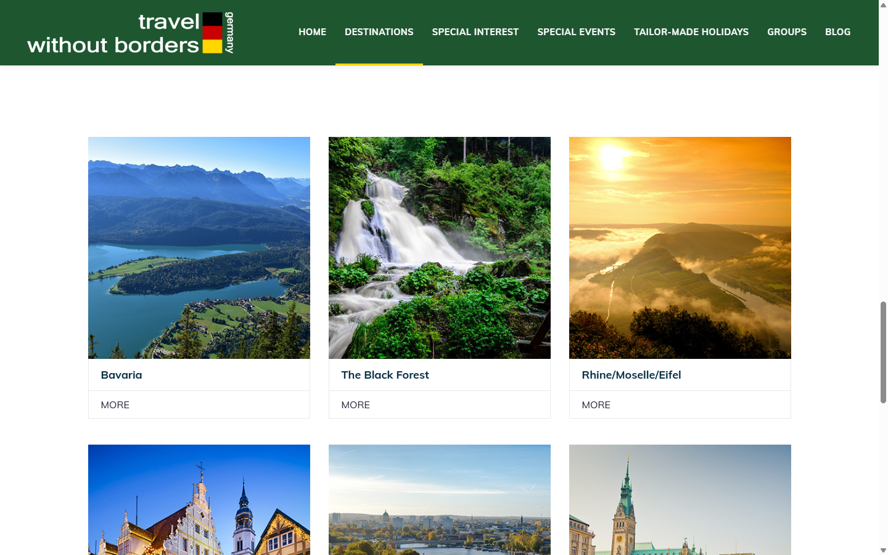
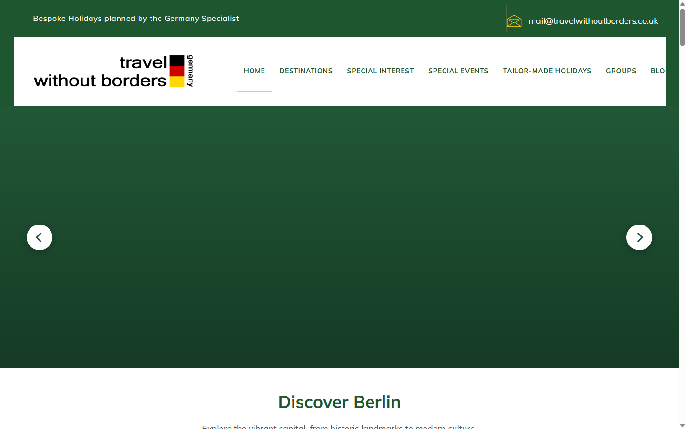

# Design System Audit — Travel Without Borders

A reference audit of the website's current visual language, captured from the
LocalWP development environment (parent theme **Ave** + **WPBakery**, child theme
`ave-child`). Its purpose is to let future work (Testimonials, homepage and
mobile improvements) feel like a **natural evolution** of the existing site
rather than an unrelated template.

- **Audited:** 2026-06-26 · LocalWP (`http://travelwithoutborders.local`)
- **Method:** computed styles measured in-browser (Playwright) at 1440 / 1024 / 820 / 390 px, plus theme option CSS and WPBakery content inspection.
- **Scope:** documentation only — no code was changed.
- **Screenshots:** [`04_Testing/DesignAudit/`](../04_Testing/DesignAudit/).

> Measurements are computed pixel values from the running site. Where the theme
> uses ems/rem the px equivalent is shown. Colours are given as the rendered RGB
> with the HEX equivalent.

---

## 0. Brand tokens (proposed canonical set)

These are the recurring values observed across the site, consolidated into a
token vocabulary for future use. **They describe what already exists** — nothing
here changes the design.

| Token | Value | HEX | Where it appears |
| ----- | ----- | --- | ---------------- |
| `--twb-green` (primary) | rgb(30,86,48) | **#1E5630** | Top bar, headings (H2), primary pill button, hero accents, footer accents |
| `--twb-navy` (heading) | rgb(3,44,66) | **#032C42** | H1 / card titles |
| `--twb-navy-deep` | rgb(24,27,49) | **#181B31** | Occasional dark headings |
| `--twb-yellow` (accent/CTA) | rgb(254,215,0) | **#FED700** | Separators, underlines, hover accents, hero arrow icon hover |
| `--twb-sage` | rgb(120,153,100) | **#789964** | Sub-headings, "Learn More" text |
| `--twb-olive-dark` | rgb(79,102,64) | **#4F6640** | Button hover |
| `--twb-link` | rgb(0,128,0) | **#008000** | In-copy text links |
| `--twb-text` (body) | rgb(39,55,68) | **#273744** | Body copy, labels |
| `--twb-text-muted` | rgb(121,123,134) | **#797B86** | Secondary text |
| `--twb-text-faint` | rgb(167,169,184) | **#A7A9B8** | Meta text |
| `--twb-text-grey` | rgb(85,85,85) | **#555555** | Hero description |
| `--twb-surface` | rgb(247,247,247) | **#F7F7F7** | Alt section background |
| `--twb-border` | rgb(224,224,224) | **#E0E0E0** | Hairline borders |
| `--twb-footer` | rgb(53,53,53) | **#353535** | Footer background |
| `--twb-white` | rgb(255,255,255) | **#FFFFFF** | Surfaces, cards, nav bar |
| `--twb-dot` | rgb(196,201,196) | **#C4C9C4** | Carousel inactive dot |
| Ambient shadow | rgba(0,0,0,0.05) | — | Default Ave element shadow |

**Off-brand value to note:** Quform form fields use **#89C712** (lime green) for
borders/required state — this is a plugin default, not a brand colour.

---

## 1. Typography

| Property | Value |
| -------- | ----- |
| Primary font family | **Muli** (Google font; humanist sans-serif), loaded by Ave |
| Base size | 16px |
| Base line-height | 28.8px (1.8) |
| Base colour | #273744 |

### Heading hierarchy (computed)

| Level | Size | Weight | Line-height | Colour | Transform | Notes |
| ----- | ---- | ------ | ----------- | ------ | --------- | ----- |
| H1 | 34px | 700 | 44.2px (1.3) | #032C42 navy | none | Page/title-bar headings |
| H2 | 36px | 700 | 43.2px (1.2) | #1E5630 green | none | Section headings (e.g. "Germany Holiday Destinations") |
| H3 | 18px | 500 | 27px (1.5) | contextual (white on dark) | none | Sub-headings |
| H4 | ~18px | 700 | — | #032C42 | none | Card titles (`.fancy-box`) |
| H5 | (rare) | — | — | — | — | Not commonly used |
| H6 | 16px | 500 | 28.8px | #181B31 | none | Minor labels |
| Body `p` | 16px | 400 | 28.8px (1.8) | #273744 | none | — |

### Links

| Context | Size | Weight | Colour | Decoration |
| ------- | ---- | ------ | ------ | ---------- |
| In-copy link | 18px | 700 | #008000 green | inherits; bolded |
| Main-nav link | 14px | 500 | #1E5630 green | uppercase, hover "underline-3" animation |
| Top-bar text/link | 16px | 500 | #FFFFFF | on green bar |

- **Letter spacing:** body/headings mostly `normal`; H2 ~0.18px; uppercase UI text (buttons/nav) uses **0.05em–0.1em** (≈1.4–1.6px).
- **Paragraph width:** content columns cap around **660–760px** of readable measure (hero description is explicitly `max-width:660px`).

---

## 2. Colour palette

Grouped from the full-page colour census (counts = element usage frequency).

| Group | Colour(s) |
| ----- | --------- |
| **Primary brand** | #1E5630 (racing green) |
| **Secondary** | #032C42 (navy), #789964 (sage), #4F6640 (olive) |
| **CTA / accent** | #FED700 (gold/yellow) — German-flag pairing with green |
| **Links** | #008000 |
| **Text** | #273744 (body), #797B86 (muted), #A7A9B8 (faint), #555555 (hero desc), #FFFFFF (on dark) |
| **Backgrounds** | #FFFFFF, #F7F7F7 (alt section), #1E5630 (green sections), #353535 (footer) |
| **Surfaces** | #FFFFFF cards |
| **Borders** | #E0E0E0 hairline |
| **Shadows** | rgba(0,0,0,0.05) ambient; rgba(0,0,0,0.15) card hover; rgba(0,0,0,0.28) hero arrows |
| **Off-brand (forms)** | #89C712 (Quform default) |

**Theme settings:** brand colours are configured in **Ave → Theme Options
(Redux, DB option `ave`)** and the **Customizer**, compiled to
`uploads/liquid-styles/`. The only hand-written custom CSS captured is minor
(`.main-nav` weight, `.fancy-box-tour` footer layout, `.hideMob` utility) — see
[`07_Source/CSS/`](../07_Source/CSS/).

---

## 3. Spacing system

Vertical rhythm is driven by **per-row WPBakery padding** plus `ld_spacer`
elements (not a strict token scale, but clustered values).

| Use | Observed values |
| --- | --------------- |
| Section padding (row top/bottom) | **70px, 75px, 80px, 85px** (largest sections) |
| Sub-section / compact rows | 28px–45px |
| Inline vertical spacers (`ld_spacer`) | commonly **28px**; also 60px |
| Hero→intro gap (tuned) | 28px (reduced from 70px) |
| Hero caption padding | 48px top / 24px sides / 8px bottom |
| Card internal padding | ~0.75em × 20px (≈12–16px) on `.fancy-box` footer |
| Container max width | ~1170px (Bootstrap `.container`); gutters 15px |

**Implied scale:** the site loosely follows an **8-based rhythm** (28 ≈ 24+, 45,
70, 75, 80, 85). Future components should standardise on **8/16/24/32/48/64/80**
to tighten this without visibly changing the look.

---

## 4. Buttons

Ave's `ld_button` provides several styles; all share **uppercase, 700 weight,
letter-spacing ~1.4–1.6px, 0.3s transitions, square corners** (except the pill).

| Style | Example | BG | Text | Radius | Border | Size/Weight | Notes |
| ----- | ------- | -- | ---- | ------ | ------ | ----------- | ----- |
| **Solid pill** (`btn-solid circle`) | "Contact" (nav) | #1E5630 | #FFF | 800px (pill) | 1px green | 16px / 700 | Primary CTA; hover → yellow |
| **Underlined** (`btn-underlined`) | "Learn More" | transparent | #789964 | 0 | yellow underline | 14px / 700 | Text + animated underline |
| **Naked** (`btn-naked`) | "Read more" / "See all" | transparent | #1E5630 or #FED700 | 0 | none | 14–16px / 700 | Inline text CTA |
| **Text** (`btn-txt`) | "Contact" | transparent | #FFF | 0 | none | 16px / 700 | On dark bars |
| **Hero arrow** (custom) | ‹ › | #FFF | green chevron | 50% | none | 54px circle | Shadow `0 4px 14px rgba(0,0,0,.28)`; hover green bg + yellow icon |

- **Transitions:** `0.3s` (Ave buttons), `0.25s cubic-bezier(0.4,0,0.2,1)` (hero arrows).
- **Inconsistency:** there is no single "primary button" treatment — the pill, underline and naked styles co-exist. Only the **hero arrows** use a radius + shadow.

---

## 5. Cards

| Component | Class | BG | Radius | Shadow | Hover | Image | Title |
| --------- | ----- | -- | ------ | ------ | ----- | ----- | ----- |
| **Destination/tour card** | `.fancy-box` | #FFF | **0** | none → on hover (transition `box-shadow 0.45s cubic-bezier(0.32,0.98,0.37,1)`, rgba(0,0,0,0.15)) | shadow lift | square **1:1**, radius 0 | 18px/700 #032C42 |
| **Blog item** | `.liquid-lp` (post) | transparent | 0 | none | (image/text) | landscape, radius 0 | navy title + excerpt + "Read more" naked button |
| **Icon box** | `.iconbox` / `ld_icon_box` | transparent | 0 | none | — | icon + heading | used for contact details |
| **Content box** | `ld_content_box` (×13 on homepage) | varies | 0 | none | reveal-on-scroll | — | generic grouped block |

- **Pattern:** cards are **flat, square-cornered, borderless**, relying on imagery
  and whitespace. The only motion is the tour card's shadow-lift on hover.
- Tour cards sit in a **3-column grid**; ~360px wide, ~457px tall.

---

## 6. Images

| Property | Behaviour |
| -------- | --------- |
| Border radius | **0 everywhere** (square corners site-wide) |
| Aspect ratios | Tour cards **1:1**; blog landscape; hero **cover** (1600×900 source) shown ~2.6:1 at 550px tall |
| Object-fit | Theme images mostly `fill`/native; **hero uses `object-fit:cover; object-position:center`** |
| Cropping | Hero crops to a fixed responsive height; tour images cropped square |
| Lazy loading | **Ave `ld-lazyload`** (replaces `src` with an inline SVG aspect placeholder + `data-src`, swaps on scroll). Hero overrides this: first slide `loading=eager fetchpriority=high`, rest `loading=lazy` |
| Hover effects | Hero linked slides: `scale(1.03)` zoom over 0.5s; tour cards: shadow (not image) |
| Overlays | Minimal; the site **avoids text-over-image** (hero deliberately places caption below the image). Destination landing pages use a dark side panel beside the hero image rather than an overlay |
| Fade-in | Lazyloaded images transition `opacity 1s` |

---

## 7. Icons

| Aspect | Finding |
| ------ | ------- |
| Libraries | **Font Awesome** (primary, ~168 uses), **Ave "Liquid" icons** (`icon-liquid`, ~7), **Elegant/Themify** set (`icon-et-*`, e.g. envelope) |
| Sizes | Contextual; header icon-box small (xs/sm), inline icons ~16px |
| Colours | #FED700 (accent icons), #1E5630 (green), #FFFFFF (on dark bars) |
| Consistency | **Mixed libraries** — functional but not a single coherent set. Future custom components should standardise on one (Font Awesome is the safest existing default) |

---

## 8. Forms

Forms are built with **Quform** (plugin) — styled largely with Quform defaults.

| Element | Value |
| ------- | ----- |
| Text input | height 44px, padding 8px, **2px solid border**, radius **5px**, font 16px, text #666 |
| Required / focus border | **#89C712 (lime — off-brand)** |
| Textarea | height ~200px, 2px #E0E0E0/#DDD border, radius 5px |
| Label | 16px / 700 / #273744 |
| Focus state | border colour change only; **no visible outline ring** |
| Validation | Quform default inline messages |
| Submit | Quform default button (neutral grey), not aligned to the brand button system |

- **Observations:** the **5px radius** and **lime-green accent** diverge from the
  otherwise square, green/gold brand. Focus accessibility is weak (colour-only).
  This is the clearest area where the site looks "plugin default" rather than
  designed.

---

## 9. Navigation

**Header** (custom WPBakery *header template*, post 4357 — `liquid-header`):

| Bar | Content | Style |
| --- | ------- | ----- |
| Top bar | Tagline ("Bespoke Holidays planned by the Germany Specialist") + email | bg **#1E5630**, white text 16px/500, yellow divider |
| Main bar | Logo · main menu · **Contact pill** | bg #FFFFFF, hairline bottom #E0E0E0 |
| Main menu | Home / Destinations / Special Interest / Special Events / Tailor-Made / Groups / Blog | uppercase, 14px/500, **#1E5630**, hover "underline-3" animation |

- **Sticky:** the header template carries sticky styling attributes, but **no
  fixed/sticky header was observed on scroll** — it scrolls away. (Either disabled
  or not triggered.)
- **Dropdowns:** Destinations expands to a large nested set (Bavaria → cities,
  Black Forest, etc.) — a deep mega-menu.
- **Desktop overflow:** at ~1366–1440px the full horizontal menu is **wider than
  the viewport** (the "Contact" pill/menu pushes a small horizontal overflow).
- **Mobile menu:** below **~1100px** the menu collapses to a hamburger
  (`.navbar-toggle.nav-trigger.style-mobile`) → off-canvas/collapse panel.

**Footer** (custom WPBakery *footer template*, post 2357): dark **#353535**
background, link columns + company/service lists, low-contrast small text.

---

## 10. Animation

| Animation | Where | Timing / Easing |
| --------- | ----- | --------------- |
| **Content reveal on scroll** | Most homepage rows (`enable_content_animation`) | translate-Y **40px** + opacity 0→1, **600ms** (one block 1200ms) |
| **Image group reveal/effects** | `ld_images_group` (`enable_reveal`, `enable_effects`) | Ave SplitText / Vivus SVG draw |
| **Card hover** | `.fancy-box` tour cards | box-shadow **0.45s** `cubic-bezier(0.32,0.98,0.37,1)` |
| **Button hover** | Ave buttons | **0.3s** |
| **Nav link hover** | main menu | animated underline ("underline-3") |
| **Hero carousel** | custom | crossfade (flickity-fade), autoplay **5000ms**, caption fade **300ms** `cubic-bezier(0.4,0,0.2,1)`, arrows **250ms**, image zoom **500ms** |
| **Lazy image fade-in** | site-wide | opacity **1s** |

Libraries present (Ave): SplitText, Vivus, Packery, **Flickity**, Fresco (lightbox).

**Easing language:** the site mixes Ave's springy `cubic-bezier(0.32,0.98,0.37,1)`
with the hero's Material-style `cubic-bezier(0.4,0,0.2,1)`. Both feel premium;
worth standardising for new components.

---

## 11. Homepage carousel (benchmark component)

The custom `[twb_hero_carousel]` child-theme element — the **reference standard**
for future premium components. Measured at 1440px desktop.

| Aspect | Spec |
| ------ | ---- |
| Width | **Full-bleed** (WPBakery "stretch row & content, no paddings"); scrollbar-safe |
| Image height | Desktop `clamp(550px,60vh,650px)` = **550px**; tablet `clamp(420,52vh,500)`; mobile `clamp(260,40vh,340)` |
| Image treatment | `object-fit:cover; object-position:center`; consistent for any photo |
| Caption | **Below** the image (never overlaid), centred, **active slide only** (`.is-selected`) |
| Title | 36px (`clamp(26,3vw,36)`) / 700 / **#1E5630** / lh 1.2 |
| Description | 18px (`clamp(15,1.4vw,18)`) / #555 / lh 1.7 / max-width **660px** |
| Caption padding | 48 / 24 / 8 px (tablet 40 top, mobile 32 top) |
| Arrows | **54px white circles** (44px mobile), shadow `0 4px 14px rgba(0,0,0,.28)`, green chevron → **yellow on hover** + scale 1.08, inset `clamp(20,4vw,56)` = 56px |
| Dots | 11px, **#C4C9C4** inactive / **#1E5630** active (scaled 1.15), below caption |
| Animation | crossfade; autoplay 5000ms (pauses on hover/interaction); wrapAround (infinite); draggable |
| Mobile | full-width, 44px touch-target arrows, fluid type, no horizontal scroll |
| Accessibility | arrows `aria-label` Previous/Next; carousel `tabindex=0` + arrow-key nav; `:focus-visible` 3px **#FED700** ring; alt text per slide; honours `prefers-reduced-motion` |
| Performance | first slide eager + `fetchpriority=high`; rest lazy; height reserved (no CLS); single Flickity instance; assets `filemtime`-versioned |
| Editing | client-editable WPBakery element (slides repeater: image, alt, title, description, destination URL, new-tab, future button fields) |

**Why it's the benchmark:** rounded, shadowed controls; brand-token colours;
restrained motion; full accessibility; performance-aware. It is noticeably more
"designed" than the surrounding flat/square components.

---

## 12. Responsive behaviour

Ave is **Bootstrap-grid based**. Observed behaviour:

| Breakpoint | Width | Behaviour |
| ---------- | ----- | --------- |
| Desktop | ≥1200px | Full horizontal menu (overflows slightly ~1366–1440); multi-column rows |
| Laptop | ~1100–1199px | Menu still horizontal near the top of this range; collapses by ~1100 |
| **Nav collapse** | **≤~1100px** | Hamburger appears (matches custom `.hideMob` 1100px rule); hamburger confirmed visible at 1024 |
| Tablet | ≤~992px | `vc_col-md-*` columns **stack** (two-column intro becomes single column) |
| Mobile | ≤767px | Single column; hero `clamp` heights shrink; arrows 44px; type scales down |

- **Typography scaling:** the legacy theme uses largely fixed px sizes; the **hero
  is the only component using fluid `clamp()`** scaling.
- **Padding adjustments:** section padding is fixed px (not reduced much on
  mobile) — large 70–85px sections can feel heavy on small screens.
- **Known issue:** desktop **header overflow** (full menu wider than viewport) is
  a parent-theme behaviour, out of scope for the child theme.

---

## 13. WPBakery structure

**Assembly model:** every page is a stack of
`vc_row → vc_column → element`. Rows carry full-width/stretch options, per-row
custom CSS (padding/background via `vc_custom_*` classes), and scroll-animation
attributes.

**Homepage element census:**

| Element | Count | Role |
| ------- | ----- | ---- |
| `vc_row` / `vc_column` | 13 / 36 | Layout grid |
| `ld_fancy_heading` | 15 | Headings (custom fonts, colour, size) |
| `vc_column_text` | 15 | Rich text blocks |
| `ld_content_box` | 13 | Grouped content blocks (reveal-on-scroll) |
| `ld_spacer` | 19 | Vertical rhythm |
| `vc_separator` | 8 | Yellow accent rules |
| `ld_button` | 6 | CTAs |
| `ld_images_group_*` | 4 | Image with reveal effects |
| `ld_carousel` | 2 | **Ave's native carousel** (already used on the homepage) |
| `ld_icon_box` | 1 | Icon + text (contact) |
| `ld_blog` | 1 | Blog grid |
| **`twb_hero_carousel`** | 1 | **Our custom child-theme element** |

**Existing reusable patterns:** two-column intro (`vc_col-md-5` + `vc_col-md-offset-1 vc_col-md-6`), centred text sections, alternating `#F7F7F7` background bands, content-box grids, blog grid, icon-box contact row.

**Recommendation for future components:**
- Register them as **WPBakery elements via `vc_map`** in the child theme
  (`inc/`), exactly like `twb_hero_carousel` — keeps everything client-editable
  in the builder.
- Enqueue CSS/JS through the child theme (`assets/`), `filemtime`-versioned, no
  inline CSS — the established pattern.
- Reuse the **brand tokens** (Section 0) and the **hero's interaction language**
  (rounded controls, fade, focus rings) so new blocks read as the premium tier.
- Where appropriate, build on existing Ave elements (`ld_content_box`,
  `ld_carousel`, `.fancy-box`) rather than reinventing, so new work inherits the
  site's structure and the client's familiarity.

---

## 14. Design language summary

### What the site already communicates
A **bespoke, specialist travel brand** with an editorial, photography-led feel.
The palette — **racing green + gold** on generous **white** space — is a clear,
tasteful nod to the German flag and reads as premium and trustworthy. **Muli**
keeps it clean and modern; large imagery and whitespace do the heavy lifting;
motion is restrained (scroll reveals, subtle hovers).

### What should remain unchanged (the identity)
- The **green (#1E5630) + gold (#FED700) + white** brand pairing.
- **Muli** typography and the heading hierarchy.
- Photography-led, **text-not-overlaid** layouts and generous whitespace.
- The uppercase, letter-spaced UI labelling.

### What feels dated / inconsistent
- **Flat, square-cornered, borderless cards** with hover-shadow only — competent
  but generic; little visual hierarchy between card types.
- **No unified button system** (pill vs underline vs naked co-exist; only the
  hero has radius/shadow).
- **Forms look like a plugin default** (Quform lime-green #89C712, 5px radius,
  colour-only focus) — the weakest, most off-brand surface.
- **Mixed icon libraries** (Font Awesome + Ave + Elegant).
- **Fixed-px spacing/type** (only the hero scales fluidly); heavy 70–85px sections
  on mobile.
- **No sticky header**; desktop **menu overflow**.

### What should evolve (without changing identity)
- Adopt the **token set** (Section 0) as CSS variables for all new work.
- Extend the **hero's interaction language** (consistent radius, soft shadow,
  brand-coloured focus rings, fluid `clamp()` type) to new premium components —
  starting with **Testimonials**.
- Standardise a **spacing scale** (8/16/24/32/48/64/80) for new components.
- Bring **forms on-brand** (green focus ring, brand button, accessible outline)
  when forms are next touched.
- Consider **one icon set** for custom components.

### Refinement opportunities (low-risk, high-impact)
1. **Testimonials** as a new `vc_map` element reusing hero tokens + Flickity — the natural next benchmark component.
2. A small shared **`tokens.css`** in the child theme so green/gold/spacing live in one place.
3. Optional gentle **card refinement** (consistent radius + soft shadow) applied only to *new* premium blocks, leaving legacy pages untouched until redesigned.
4. Accessibility uplift carried forward from the hero (focus rings, alt text, reduced-motion) as a standard for every new component.

---

## Appendix — screenshots

| File | Shows |
| ---- | ----- |
| [`hero-carousel-desktop.png`](../04_Testing/DesignAudit/hero-carousel-desktop.png) | Benchmark hero carousel (arrows, caption) |
| [`homepage-flow-desktop.png`](../04_Testing/DesignAudit/homepage-flow-desktop.png) | Carousel → introduction flow |
| [`homepage-mobile.png`](../04_Testing/DesignAudit/homepage-mobile.png) | Mobile stacking + type scaling |
| [`cards-destinations.png`](../04_Testing/DesignAudit/cards-destinations.png) | Destination/tour card grid |

> This document is a point-in-time audit of the current site. It is the reference
> for future design/development decisions and should be updated as the design
> system evolves (e.g. once Testimonials establishes new shared patterns).
