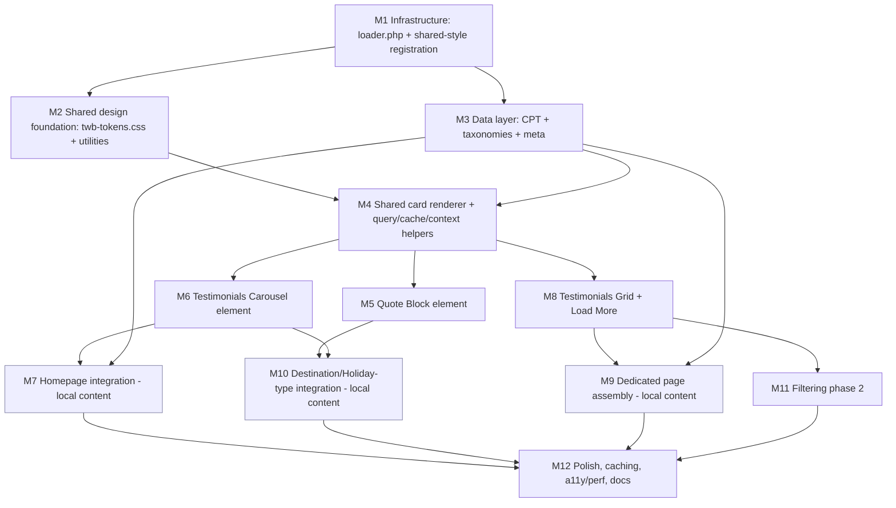
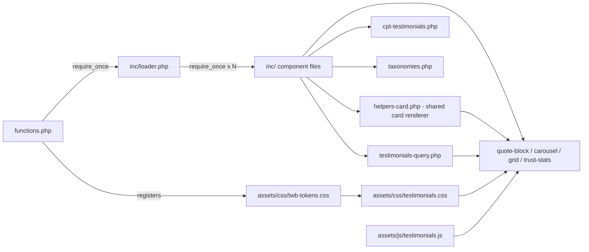
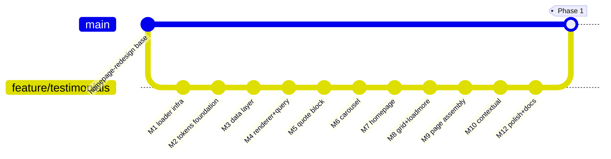

# Testimonials — Implementation Plan

The definitive build roadmap for the Testimonials feature inside this repository.
Detailed enough that an experienced developer can implement the feature **without
referring back to the planning conversations**.

- **Status:** plan (documentation only — no code, no WordPress, no file changes).
- **Authoritative references (do not duplicate):**
  [Design System Audit](DESIGN_SYSTEM_AUDIT.md) ·
  [UX & IA Audit](UX_INFORMATION_ARCHITECTURE_AUDIT.md) ·
  [Component Architecture Audit](COMPONENT_ARCHITECTURE_AUDIT.md) ·
  [Testimonials System Specification](TESTIMONIALS_SYSTEM_SPECIFICATION.md) (the *what*; this is the *how*) ·
  [ADR-001 — Testimonials Architecture](Architecture/ADR-001-Testimonials-Architecture.md) (the *why*).
- **Workflow reference:** [Local Development Workflow](LOCAL_DEV_WORKFLOW.md).

### Terminology (used consistently across all planning docs)
| Term | Means |
| ---- | ----- |
| **Component** | A complete reusable unit = data + shared renderer + isolated assets + WPBakery element + docs (e.g. "the Testimonials Carousel component") |
| **Element** | The WPBakery `vc_map` registration / shortcode that presents a component (e.g. `[twb_testimonials_carousel]`) |
| **Shared token layer** | `assets/css/twb-tokens.css` — CSS custom properties + base/spacing utilities every component inherits |
| **Shared card renderer** | `inc/helpers-card.php` → `twb_render_testimonial_card()` — the single function that renders a testimonial card everywhere |
| **Loader** | `inc/loader.php` — explicit `require_once` statements in dependency order |
| **Trust Band** | The credibility-strip component; its element is `[twb_trust_stats]` |

### Repository facts (verified)
| Fact | Value |
| ---- | ----- |
| Canonical code path | `07_Source/Themes/ave-child/` (junctioned into LocalWP) |
| Current branch | `feature/homepage-redesign` |
| Existing component files | `inc/hero-carousel.php`, `assets/css/hero-carousel.css`, `assets/js/hero-carousel.js` |
| Asset versioning | `filemtime()` (already in `functions.php`) |
| Element registration | `vc_map` on `vc_before_init`; assets enqueued on render |
| Never edit | parent theme `ave`, plugins, production site |

> **Code vs content boundary (critical):** PHP that *registers* the CPT,
> taxonomies and elements is **version-controlled code** in the child theme.
> Sample testimonials and page assembly happen in the **local WordPress DB** and
> are **not** version-controlled (local-only). Milestones flag which is which.

---

## 1. Executive summary

**Goal:** implement the Testimonials System Specification as a set of small,
reversible commits within the established child-theme + junction + Git workflow,
reusing the proven `twb_hero_carousel` pattern (WPBakery element, on-demand
assets, bundled Flickity, shared tokens, a11y/perf bar).

**Major deliverables:**
1. **Infrastructure** — `inc/loader.php` (explicit, ordered requires) + shared-stylesheet registration plumbing.
2. **Shared design foundation** — the **shared token layer** (`twb-tokens.css`): CSS variables, spacing scale, base utilities.
3. **Data layer** — `twb_testimonial` CPT + shared taxonomies (`twb_region`, `twb_holiday_type`, `twb_interest`) + meta.
4. **Shared renderer + query layer** — the **shared card renderer** + query/cache/context helpers.
5. **Four WPBakery elements** — `[twb_quote_block]`, `[twb_testimonials_carousel]`, `[twb_testimonials_grid]`, `[twb_trust_stats]` (Trust Band).
6. **Integrations (local content)** — homepage band, dedicated page, destination/holiday-type placements.
7. **Docs + tests** at every step.

**Strategy:** **infrastructure → shared design foundation → data → shared renderer
→ smallest element first → larger elements → integration → polish.** Build code
once, compose pages in WPBakery. Every milestone is one reviewable commit with its
own tests and rollback path. Phase 1 ships a complete, usable system; advanced
search/analytics/REST features are explicitly deferred (Section 13).

---

## 2. Repository engineering principles

Permanent engineering rules for this repository. Every milestone and every future
component must satisfy them.

1. **Reuse before creating new code.** Prefer existing helpers, the shared renderer, bundled libraries and tokens over new code.
2. **Never duplicate component markup.** One renderer, used everywhere.
3. **Every repeated UI becomes a reusable component.** If a pattern appears twice, it becomes a component, not a copy.
4. **Components own their own assets.** Each component's CSS/JS lives in its own files and is enqueued only when it renders.
5. **Shared styles belong in the shared token layer.** Colour, spacing, radius, shadow, motion, container widths live in `twb-tokens.css`; components reference `var(--twb-*)` — never hard-code repeatable values.
6. **No parent theme modifications.** All work in the child theme; never edit `ave` or plugins.
7. **WPBakery remains client-editable.** Components are WPBakery elements with sensible params; no HTML/CSS required of the editor.
8. **Progressive enhancement over JavaScript dependency.** Content and core actions work without JS; JS enhances.
9. **Accessibility by default.** Semantics, keyboard, ARIA, focus, reduced-motion, AA contrast are built in, not bolted on.
10. **Performance before animation.** No CLS, on-demand assets, no new libraries; motion is subtle and respects reduced-motion.
11. **Documentation evolves with implementation.** Update the relevant docs in the same change.
12. **Small, reversible commits.** One logical milestone per commit; never mix unrelated changes.

---

## 3. Testimonials as the canonical component template

**Testimonials is not just a feature — it is the reference implementation for
every future TWB component.** It is the first component to fully exercise the
target architecture end-to-end, so it sets the pattern the whole library follows.

Future systems — **FAQs, Travel Guides, CTA Bands, Trust Bands, Holiday Types,
Featured Destinations, Special Offers, Customer Stories** — must follow the **same
architectural pattern**:

| Pattern element | Standard set by Testimonials |
| --------------- | ---------------------------- |
| Dedicated `inc/` registration | One file per concern, wired via `inc/loader.php` |
| Isolated CSS | One component stylesheet under `assets/css/` |
| Isolated JS | One component script under `assets/js/`, reusing bundled libs |
| Shared tokens | All styling references the shared token layer |
| Reusable renderer | A single render function/partial, never duplicated markup |
| Data abstraction | A query/helper layer between data (CPT/taxonomy/meta) and presentation |
| `vc_map` | Presented as client-editable WPBakery element(s) |
| Documentation | Component documented (params, data, dependencies) |
| On-demand assets | Enqueued only when the element renders; `filemtime` versioned |
| Accessibility baseline | Keyboard, ARIA, focus, reduced-motion, AA contrast |
| Performance baseline | No CLS, no new libraries, cached queries |

> When building any future component, copy this structure. The Testimonials
> implementation is the canonical template; deviations require an ADR.

---

## 4. The loader architecture (explicit decision)

**Decision:** `functions.php` loads a single `inc/loader.php`, which contains
**explicit `require_once` statements in dependency order** — **not** a glob/loop
over `inc/`.

```
functions.php
    └── require_once inc/loader.php

inc/
    loader.php                  ← explicit, ordered require_once list
    cpt-testimonials.php
    taxonomies.php
    testimonials-query.php
    helpers-card.php            ← shared card renderer
    quote-block.php
    testimonials-carousel.php
    testimonials-grid.php
    trust-stats.php
```

**`inc/loader.php` load order** (dependencies first):

```
hero-carousel.php          (existing component — unchanged)
taxonomies.php             (shared taxonomies — no dependencies)
cpt-testimonials.php       (CPT — references taxonomy slugs at init)
testimonials-query.php     (query + cache + context — needs CPT/taxonomies at runtime)
helpers-card.php           (shared card renderer)
quote-block.php            (element → renderer + query)
testimonials-carousel.php  (element → renderer + query + JS)
testimonials-grid.php      (element → renderer + query + JS + AJAX)
trust-stats.php            (Trust Band element)
```

**Why explicit requires in a loader (not a glob/loop):**
- **Deterministic loading** — load order is guaranteed regardless of filesystem/OS ordering.
- **Easier debugging** — the load sequence is readable in one file; a fatal is traceable to a line.
- **Predictable dependencies** — dependency order is encoded and visible, not implicit.
- **Reduced merge conflicts** — adding a component is a single, well-placed line; `functions.php` never changes again after M1.
- **Easier onboarding** — a new contributor sees the entire component graph and boot order at a glance.

A glob/loop was **rejected**: non-deterministic order, hidden dependencies, harder
debugging, and silent inclusion of stray/partial files. (See
[ADR-001](Architecture/ADR-001-Testimonials-Architecture.md).)

Each milestone that adds an `inc/` file **also adds its `require_once` line to
`loader.php`** in the correct position — `functions.php` is touched only in M1.

---

## 5. Dependency graph



**Hard ordering:** Infrastructure (M1) gates everything. The shared design
foundation (M2) and data layer (M3) are independent of each other and both feed
the shared renderer (M4), which gates all elements. Elements (M5/M6/M8) are
independent once M4 lands → buildable/reviewable in parallel. Integration
milestones (M7/M9/M10, blue = local content) depend on their element. Filtering
(M11) and Polish (M12) come last.

---

## 6. Repository impact assessment

All paths under `07_Source/Themes/ave-child/` unless noted. **Reuses existing
conventions; introduces no new top-level directories.**

| Directory | Create | Modify | Reference (read) |
| --------- | ------ | ------ | ---------------- |
| `inc/` | `loader.php`, `cpt-testimonials.php`, `taxonomies.php`, `testimonials-query.php`, `helpers-card.php`, `quote-block.php`, `testimonials-carousel.php`, `testimonials-grid.php`, `trust-stats.php` | (`loader.php` gains one require per component milestone) | `hero-carousel.php` (pattern reference) |
| `assets/css/` | `twb-tokens.css`, `testimonials.css` | — | `hero-carousel.css` (pattern) |
| `assets/js/` | `testimonials.js` | — | `hero-carousel.js` (pattern) |
| (theme root) | — | `functions.php` (**M1 only**: require `inc/loader.php`, register shared `twb-tokens` style, register AJAX action) | `style.css` |
| `01_Documentation/` | `COMPONENTS.md` *(optional, M12)* | `CHANGELOG.md`, `DEVELOPMENT_LOG.md`, `INDEX.md`, `PROJECT_STATUS.md` | the reference docs + ADR-001 |
| `01_Documentation/Architecture/` | `ADR-001-Testimonials-Architecture.md` *(this refinement)* | — | — |
| `04_Testing/` | `Testimonials/` (screenshots, evidence) | — | — |
| **LocalWP DB (not VCS)** | sample testimonials; homepage/page/destination assembly | front-page/page content | — |

**Notes / conventions:**
- Components live in `inc/` (render in callbacks) + `assets/`, matching the hero.
  **No `templates/` or `vc-elements/` directory exists or should be added.**
- After M1, **`functions.php` is not modified again** for component additions —
  each new component is a `require_once` line in `loader.php`. This minimises
  merge conflicts.
- `twb-tokens.css` is a **shared dependency** declared by component styles
  (e.g. `wp_register_style('twb-testimonials', …, ['flickity','twb-tokens'])`),
  enqueued on demand.



---

## 7. Milestone breakdown

Each milestone = **one logical Git commit**. Effort: S ≈ <½ day, M ≈ ½–1 day.
Rollback complexity assumes Git revert of that commit (code); local DB content is
reversible via the backup notes in each integration milestone.

| M | Title | Objective | Files affected | Depends | Risks | Rollback | Effort | Tests before next |
| - | ----- | --------- | -------------- | ------- | ----- | -------- | ------ | ----------------- |
| **M1** | Infrastructure (loader) | Add `inc/loader.php`; route `functions.php` through it; register shared-style plumbing — **no tokens, no feature code** | `inc/loader.php` (new), `functions.php`; empty `assets/css/twb-tokens.css` stub | — | Low — additive; must not break hero require | Trivial (revert) | S | Site loads; **hero unchanged**; loader requires hero file |
| **M2** | Shared design foundation | Populate the shared token layer: CSS variables (colour/type/spacing 8–80/radius/shadow/motion/containers) + base/spacing utilities | `assets/css/twb-tokens.css` | M1 | Token CSS bleed/clash with Ave | Revert | S–M | Token vars resolve; utilities apply only via `.twb-*`; no global regressions |
| **M3** | Data layer | Register `twb_testimonial` CPT + shared taxonomies + meta + admin UI | `inc/cpt-testimonials.php`, `inc/taxonomies.php` (new), `inc/loader.php` | M1 | Rewrite/permalink flush; slug collisions | Revert + re-flush permalinks | M | CPT in admin; terms save; **permalinks flushed**; create 3–5 samples |
| **M4** | Shared card renderer + query helpers | The single card renderer + query/cache/context fallback layer | `inc/helpers-card.php`, `inc/testimonials-query.php` (new), `assets/css/testimonials.css` (new), `inc/loader.php` | M2, M3 | Fallback edge cases | Revert | M | Renderer output verified via a temporary debug shortcode; fallbacks/empty states correct; cache hit |
| **M5** | Quote Block element | Smallest element first: single contextual quote | `inc/quote-block.php` (new), `inc/loader.php` | M4 | Context detection accuracy | Revert (element gone; pages degrade gracefully) | S | Place on a region page; context + manual modes; a11y |
| **M6** | Testimonials Carousel element | Featured/contextual carousel (reuse Flickity) | `inc/testimonials-carousel.php` (new), `assets/js/testimonials.js` (new), `assets/css/testimonials.css`, `inc/loader.php` | M4 | Flickity double-init; CLS | Revert | M | Autoplay/keyboard/reduced-motion; mobile; 0 console errors |
| **M7** | Homepage integration *(local content)* | Trust Band + featured carousel on homepage | `inc/trust-stats.php` (new), `inc/loader.php`; **homepage content (DB, local)** | M3, M6 | Editing local homepage; layout shift | Restore homepage from backup meta | S | Position/CTA/responsive; screenshots; hero still intact |
| **M8** | Testimonials Grid + Load More | Dedicated-page grid + AJAX load-more (paged fallback) | `inc/testimonials-grid.php` (new), `assets/js/testimonials.js`, `functions.php`? **no** → AJAX action registered in its own file + hooked; `inc/loader.php` | M4 | AJAX nonce/perf; pagination correctness | Revert | M | Pagination; no-JS fallback; empty state |
| **M9** | Dedicated page assembly *(local content)* | Build the Testimonials page in WPBakery | **page content (DB, local)**; new page | M3–M8 | Page-build only (no code) | Trash the page | S | Full-page responsive + a11y pass |
| **M10** | Destination/type integration *(local content)* | Contextual placements + fallbacks | **region & holiday-type pages (DB, local)** | M5/M6 | Editing multiple local pages | Restore pages from backups | M | Context detection; fallback chain on real pages |
| **M11** | Filtering (phase 2) | Region/Holiday-type facets, progressive | `inc/testimonials-grid.php`, `assets/js/testimonials.js` | M8 | JS complexity; no-JS parity | Revert (grid stays usable) | M | Facets + paged fallback; a11y of controls |
| **M12** | Polish + docs | Caching, a11y/perf verification, component docs | `assets/css|js`, `inc/*`, `01_Documentation/COMPONENTS.md` | all | Low | Revert | S–M | Full QA + SR pass + Lighthouse-style |

> **AJAX note (M8):** the load-more action (`wp_ajax_*`) is registered from
> `testimonials-grid.php` (the component owns its behaviour, per Principle 4), not
> by adding logic to `functions.php`.

**Sizing guardrail:** if any milestone grows beyond ~one focused session or
touches more than ~3 code files meaningfully, split it.

---

## 8. Detailed task list (per milestone)

> Each milestone's **Definition of Done (DoD)** = its checklist complete + its
> Section 9 tests pass + Section 11 quality gates green + commit made.

### M1 — Infrastructure (loader)
- [ ] Create `inc/loader.php` with an explicit, ordered `require_once` list (Section 4); initially it requires **`hero-carousel.php`** only (the only component that exists).
- [ ] Change `functions.php` to `require_once …/inc/loader.php` (replacing the direct hero require). Confirm the hero still loads.
- [ ] Add shared-style registration: register a `twb-tokens` handle (`filemtime` version) pointing at `assets/css/twb-tokens.css`; create that file as an **empty stub** (no tokens yet).
- **Acceptance:** site loads; hero renders identically; `functions.php` references only the loader + shared-style registration; no console/PHP errors.
- **DoD:** committed; hero regression-checked.

### M2 — Shared design foundation
- [ ] Populate `assets/css/twb-tokens.css`: `:root` CSS variables for the Design-Audit tokens (colour, type scale, spacing **8/16/24/32/48/64/80**, radius, shadow, motion durations/easing, container widths) + minimal base/spacing utilities scoped to `.twb-*`.
- **Acceptance:** variables resolve in DevTools; utilities affect only `.twb-*`; no global/hero regression.
- **DoD:** committed.

### M3 — Data layer
- [ ] `inc/cpt-testimonials.php`: register `twb_testimonial` (labels, icon, `supports` title+editor+thumbnail, `show_in_rest` true); register meta (`featured` bool, `rating` int, `author_name`, `author_location`, `travel_date`, `source`) with `show_in_rest` + sanitise callbacks.
- [ ] `inc/taxonomies.php`: register shared `twb_region`, `twb_holiday_type`, `twb_interest` (`show_in_rest`), attached to the CPT (reusable by future CPTs).
- [ ] Add both files to `inc/loader.php` (taxonomies before CPT).
- [ ] Document the **one-time permalink flush** (Settings → Permalinks → Save).
- [ ] Create 3–5 **sample** testimonials locally (varied region/type; one featured; one with rating; one minimal for fallback tests).
- **Acceptance:** CPT + taxonomies in admin; meta saves; single URLs resolve; samples exist.
- **DoD:** committed (code only; samples are local).

### M4 — Shared card renderer + query helpers
- [ ] `inc/helpers-card.php`: `twb_render_testimonial_card($post, $opts)` → semantic `figure/blockquote/figcaption/cite`, optional rating/avatar/badges, truncation, initial-letter avatar fallback. **This is the single renderer used by every element.**
- [ ] `inc/testimonials-query.php`: `twb_get_testimonials($args)` with source modes (featured/region/type/context/manual), featured-first ordering, **transient caching** keyed by args, context detection from the current page's terms, and the **contextual → featured → empty** fallback.
- [ ] `assets/css/testimonials.css`: card styles using the shared token layer (square default; hover shadow per Design Audit); declare `twb-tokens` as a dependency.
- [ ] Add both files to `inc/loader.php`.
- **Acceptance:** a temporary debug shortcode renders cards correctly incl. fallbacks/empty states; cache hit verified.
- **DoD:** committed; temp shortcode removed/guarded before commit.

### M5 — Quote Block (`[twb_quote_block]`)
- [ ] `inc/quote-block.php`: `vc_map` (params: source mode, manual select, show rating/avatar/badge, section options) + render via the **shared card renderer**; enqueue token + testimonials CSS on render. Add to loader.
- **Acceptance:** editable in WPBakery (TWB category); context + manual modes; graceful when no match.
- **DoD:** committed; placed on a test region page locally.

### M6 — Testimonials Carousel (`[twb_testimonials_carousel]`)
- [ ] `inc/testimonials-carousel.php`: `vc_map` + render (multiple cards) reusing the shared card renderer. Add to loader.
- [ ] `assets/js/testimonials.js`: Flickity init (reuse Ave handle), single-init guard, options via data attribute (autoplay, fade, wrapAround, pageDots, prevNextButtons, draggable, pauseAutoPlayOnHover), reduced-motion respect.
- [ ] Arrow/dot styling from the shared token layer (match hero interaction language).
- **Acceptance:** autoplay/keyboard/drag/dots/arrows; mobile 44px targets; reduced-motion; 0 console errors; no CLS.
- **DoD:** committed.

### M7 — Homepage integration *(local content)*
- [ ] `inc/trust-stats.php`: `vc_map` + render the **Trust Band** (stat items: number + label; values via element params or Theme Options). Add to loader.
- [ ] **Back up** current homepage `post_content` to post meta before editing.
- [ ] Insert Trust Band + Featured Carousel high on the homepage; add "Read all reviews →" CTA.
- **Acceptance:** correct position/CTA; responsive; hero unaffected; backup recorded.
- **DoD:** committed (code: `trust-stats.php`; homepage content is local — note in commit body).

### M8 — Grid + Load More (`[twb_testimonials_grid]`)
- [ ] `inc/testimonials-grid.php`: `vc_map` + render (paged grid via the shared card renderer); register the AJAX `wp_ajax_(nopriv_)twb_testimonials_load_more` action **within this file**; nonce; returns next page markup; **paged-link fallback** without JS. Add to loader.
- [ ] `assets/js/testimonials.js`: load-more handler + ARIA live region.
- **Acceptance:** pagination correct; empty state; no-JS fallback; nonce verified.
- **DoD:** committed.

### M9 — Dedicated page assembly *(local content)*
- [ ] Create the **Testimonials** page; assemble per spec §4 order (hero → Trust Band → featured → grid → CTA).
- [ ] Add to primary nav (local menu).
- **Acceptance:** full-page responsive + a11y; matches spec order.
- **DoD:** committed (note: local content).

### M10 — Destination/type integration *(local content)*
- [ ] Back up each edited page's content; add Quote Block / mini-carousel to representative region + holiday-type pages (context mode).
- [ ] Verify the fallback chain on a page with no matching testimonials.
- **Acceptance:** contextual quotes show; fallbacks correct; no empty boxes.
- **DoD:** committed (local content).

### M11 — Filtering (phase 2)
- [ ] Add region/holiday-type facets to the grid (server-rendered paged links; JS-enhanced to AJAX).
- [ ] Empty state per filter; accessible controls.
- **Acceptance:** facets work with and without JS; a11y.
- **DoD:** committed.

### M12 — Polish + docs
- [ ] Verify transient caching + bust on `save_post_twb_testimonial`.
- [ ] Full a11y (SR pass) + perf (no CLS, asset-on-demand) verification.
- [ ] `01_Documentation/COMPONENTS.md` (or extend the Component Architecture Audit) documenting the four elements + params + data.
- **Acceptance:** all acceptance criteria in spec §15 + Section 10 metrics met.
- **DoD:** committed; docs updated.

---

## 9. Testing plan (run before starting the next milestone)

| Test type | What to do | Applies to |
| --------- | ---------- | ---------- |
| **Manual** | Exercise each element's modes/params; create/edit testimonials | M3–M12 |
| **Responsive** | Playwright at **390 / 768 / 1024 / 1440**; check grid cols, spacing, type, 44px targets, no horizontal scroll | M4–M11 |
| **Accessibility** | Keyboard nav; `:focus-visible` ring; ARIA; one **screen-reader pass**; reduced-motion; AA contrast; heading hierarchy | M4–M12 |
| **Regression** | Confirm **hero carousel + homepage unchanged**; no global CSS bleed (token scope); other pages unaffected | every milestone |
| **WPBakery editor** | Element appears under TWB category; params save; front-end matches editor; no builder errors | M5–M11 |
| **Performance** | Assets load **only** where an element renders; bundled Flickity reused; no CLS; lazy avatars; cache hit | M6, M8, M12 |
| **Cross-browser** | Chromium (primary via Playwright); spot-check Firefox; note PHP is 7.4 locally | M6, M8, M11, release |
| **PHP health** | `php -l` each new file; watch `debug.log` for warnings from `twb_*` | M1–M12 |
| **Console** | 0 errors across desktop + mobile | M6, M8, M11 |

> **Gate:** a milestone is not "done" until its row above is green. No milestone
> starts before the previous one's tests pass.

---

## 10. Engineering success metrics (objective acceptance criteria)

These replace subjective "looks good" judgements with measurable targets. All
must hold before Phase 1 is considered complete.

### Performance
- **No cumulative layout shift** introduced by any testimonial component (CLS contribution ≈ 0; media/heights reserved).
- **Assets load only when a component renders** (verify the testimonials CSS/JS are absent on pages with no testimonial element).
- **No new JS libraries** added (only Ave's bundled Flickity is used).
- **Minimal CSS duplication** (component CSS references the shared token layer; no repeated colour/spacing literals).
- **Transient cache hit verified** (second identical query served from cache; busts on testimonial save).

### Accessibility
- **Full keyboard navigation** of carousel, grid, filters and load-more.
- **Screen-reader verification** pass (quote + attribution announced coherently).
- **`prefers-reduced-motion` supported** (autoplay/transitions disabled).
- **AA colour contrast** (≥4.5:1 body/quote; badges verified on their backgrounds).
- **Correct heading hierarchy** (one H1 per page; section H2s; cards use `blockquote`, not headings).

### Responsive
- Verified at **390 / 768 / 1024 / 1440** px: grid 3→2→1; carousel 1-up on mobile; 44px touch targets; **no horizontal scroll** at any width.

### Maintainability
- **Single card renderer** (`helpers-card.php`) used by all elements — **no duplicated testimonial markup**.
- **Single query helper** (`testimonials-query.php`) — all data access goes through it.
- **Shared token stylesheet** is the only source of brand/spacing values.
- **One responsibility per component file** (data, query, renderer, each element separate).

### Repository health
- **Parent theme untouched** · **plugins untouched** · **production untouched** (`git status` only ever shows `07_Source/Themes/ave-child/` + docs).
- **All new code namespaced `twb_`** (PHP), `.twb-` (CSS), `twb_*` (CPT/taxonomy/AJAX/hooks).

---

## 11. Quality gates (mandatory before continuing past any milestone)

```
✓ Coding standards (BEM + twb- prefix; shared tokens; no inline CSS; PHP 7.4; escape/sanitise)
✓ Accessibility (keyboard, ARIA, focus-visible, reduced-motion, AA contrast, heading order)
✓ Responsive (390/768/1024/1440; 44px targets; no horizontal scroll)
✓ Performance (asset-on-demand; Flickity reused; no CLS; queries limited/cached)
✓ WPBakery usability (TWB category; params save; editor == front-end)
✓ No parent theme edits
✓ No plugin edits
✓ No production changes
✓ Hero + existing pages regression-clean
✓ Documentation updated (same change)
✓ Manual + responsive + a11y testing complete (Section 9)
✓ 0 console errors, 0 PHP warnings from twb_*
✓ Git committed (small, scoped, on feature/testimonials)
```

---

## 12. Risk assessment

| # | Risk | Type | Likelihood | Impact | Mitigation | Rollback |
| - | ---- | ---- | ---------- | ------ | ---------- | -------- |
| R1 | CPT/taxonomy **permalink flush** missed → 404s on single testimonials | Technical | Med | Med | Documented manual flush step (M3); register on `init` | Re-save permalinks |
| R2 | **Token CSS bleeds** globally / clashes with Ave | Architectural | Low | Med | Define vars on `:root` but *use* only via `.twb-*`; namespaced classes | Revert **M2** |
| R3 | **Flickity double-init** or conflict with Ave's `data-lqd-flickity` | WPBakery/Theme | Low | Med | Single-init guard + own data attribute (hero-proven) | Revert **M6** |
| R4 | Editing **local homepage/pages** corrupts layout | Backward-compat | Med | Med | Back up `post_content` to meta before each edit (proven pattern) | Restore from backup meta |
| R5 | **AJAX load-more** nonce/perf issues | Technical | Med | Low | Nonce + capability check; paged-link fallback; query limits | Revert **M8/M11** |
| R6 | **Slug collisions** (`twb_region` vs existing taxonomies/pages) | Technical | Low | Med | Verify slugs unused before M3; prefix `twb_` | Adjust slug + re-flush |
| R7 | Plugin/theme update changes Flickity/WPBakery APIs | Future maintenance | Low | Med | Reuse stable handles; isolate in child theme; document deps | Pin/adjust in child theme |
| R8 | Scope creep into filtering/search early | Process | Med | Low | Phase boundary (Section 13); facets deferred to M11 | N/A |
| R9 | Editing parent theme/plugins by mistake | Compatibility | Low | High | Quality gate + `git status` only touches child theme | Revert |
| R10 | Caching serves stale testimonials | Technical | Low | Low | Bust transients on save (M12); short TTL | Clear transients |
| R11 | **Loader misorder** → fatal on missing dependency | Technical | Low | Med | Explicit ordered requires (Section 4); `php -l` each file | Revert offending milestone |

---

## 13. Git workflow

### Branch strategy
- Create a dedicated **`feature/testimonials`** branch off the current
  `feature/homepage-redesign` (or `main` if homepage work is merged) to isolate
  the feature and keep PRs reviewable.
- One commit per milestone (M1–M12). Open a PR when M1–M9 (Phase-1 core) are
  ready; M11 (filtering) may be a follow-up PR.



### Commit boundaries & naming
- Boundary = one milestone; never mix code + unrelated content; note local-only DB
  changes in the commit body ("content assembled locally; not version-controlled").
- Convention (consistent with repo history): concise imperative subject; end with
  the Co-Authored-By trailer per repo policy.

**Suggested commit messages:**
| M | Message |
| - | ------- |
| M1 | `Add inc/loader.php infrastructure and shared-style registration` |
| M2 | `Add shared design token layer (twb-tokens.css) and utilities` |
| M3 | `Add Testimonial CPT and shared taxonomies (region, holiday type)` |
| M4 | `Add shared testimonial card renderer and query/cache helpers` |
| M5 | `Add [twb_quote_block] WPBakery element` |
| M6 | `Add [twb_testimonials_carousel] element (Flickity)` |
| M7 | `Add Trust Band [twb_trust_stats] and integrate testimonials on homepage` |
| M8 | `Add [twb_testimonials_grid] with AJAX load-more` |
| M9 | `Assemble dedicated Testimonials page (local content)` |
| M10 | `Add contextual testimonials to destination/holiday-type pages (local)` |
| M11 | `Add testimonial filtering by region and holiday type` |
| M12 | `Testimonials: caching, a11y/perf polish, component docs` |

### Review checkpoints & merge readiness
- **Checkpoint 1:** after **M4** (infrastructure + foundation + data + shared renderer solid).
- **Checkpoint 2:** after **M7** (first visible homepage value).
- **Merge-ready (Phase 1):** **M1–M10 + M12** complete; all Section 11 gates green;
  Section 10 metrics met; Section 14 release checklist passed; docs updated.

---

## 14. Documentation updates (per milestone)

| After | Update |
| ----- | ------ |
| M1 | `DEVELOPMENT_LOG` (loader infra); note loader in component docs |
| M2 | `DEVELOPMENT_LOG` (token layer); cross-ref Design System Audit tokens |
| M3 | `CHANGELOG` (Unreleased), `DEVELOPMENT_LOG`; record CPT/taxonomy slugs + permalink-flush step |
| M4–M6, M8, M11 | `DEVELOPMENT_LOG`; element params in `COMPONENTS.md` |
| M7, M9, M10 | `DEVELOPMENT_LOG` + **implementation/testing notes** (which local pages edited, backup meta keys) |
| M12 | `CHANGELOG` (feature summary), `PROJECT_STATUS` (phase progress), `COMPONENTS.md`, `INDEX.md`; reconcile with the spec + ADR-001 |
| Always | Keep the reference docs + ADR authoritative; update the ADR if a decision changes |

---

## 15. Final release checklist (Phase 1)

| Category | Checks |
| -------- | ------ |
| **Functional** | CPT/taxonomies/meta work; all four elements render; source modes (featured/region/type/context/manual); fallback chain; AJAX load-more + no-JS fallback; CTAs link correctly |
| **Visual** | Matches the shared token layer; reads as hero-tier quality; square cards (or approved direction); badges/stars/avatars correct |
| **Responsive** | Verified 390/768/1024/1440; grid 3→2→1; carousel 1-up mobile; 44px targets |
| **Accessibility** | Semantic figure/blockquote/cite; keyboard; ARIA + live region; focus rings; reduced-motion; AA contrast; SR pass |
| **Performance** | Assets only where rendered; Flickity reused; no CLS; lazy avatars; transient cache + bust on save |
| **Regression** | Hero unchanged; homepage/other pages intact; no global CSS bleed |
| **Browser** | Chromium pass; Firefox spot-check |
| **Editor usability** | Client can add testimonials + drop/configure elements unaided |
| **Documentation** | CHANGELOG/DEV_LOG/PROJECT_STATUS/COMPONENTS/INDEX updated; spec + ADR reconciled |
| **Git history** | One commit per milestone on `feature/testimonials`; clean messages; only child-theme code tracked; local content noted |
| **LocalWP validation** | Site serves via junction; permalinks flushed; samples + pages present; 0 console/PHP errors |
| **Production readiness** | Deployment notes prepared: CPT/taxonomy/element code deploys with the theme; **real testimonials + page assembly must be recreated/migrated on production** (DB content is local); permalink flush on prod; follow `05_Deployment` checklist; pre-deploy backup |

> **Production caveat:** version-controlled code (CPT/taxonomies/elements) deploys
> with the child theme, but **testimonial records and page layouts live in the
> database** — plan a content migration/recreation step and a permalink flush on
> production (see Deployment docs). Never edit production directly.

---

## 16. Future expansion (explicitly scoped)

| Included in **Phase 1** | Deferred to **future phases** |
| ----------------------- | ----------------------------- |
| Infrastructure (loader) + shared token layer | — |
| CPT + shared taxonomies + meta | Public (moderated) review **submission form** |
| Shared card renderer + four elements (Quote, Carousel, Grid, Trust Band) | Third-party **review sync** (Google/Feefo/Trustpilot) + platform badges |
| Featured + contextual (region/type) + fallback | **Full keyword search** + REST-driven facet UI |
| Basic **filtering by region/holiday type** (M11) | Filtering by **rating / year / country / travel style** |
| AJAX **load-more** (with no-JS fallback) | Infinite scroll; advanced pagination UX |
| Homepage band + dedicated page + destination/type placements | **Destination recommendation engine** / personalised proof |
| Transient caching | **Ratings analytics**/dashboards; aggregate `Review` schema (until ratings exist) |
| Reuse of hero interaction language | Reusing filter/load-more/empty-state for **Guides & Blog** |
| A11y/perf to hero standard | Further homepage enhancements beyond the testimonials band |

**Boundary rule:** Phase 1 delivers a complete, trustworthy, reusable
testimonials system that fixes the UX-audit gaps. Anything requiring new data
sources, heavy JS, or analytics is deferred and must be re-specified before build.

---

## Definition of Done (feature-level)

The feature is complete when: all Phase-1 milestones (**M1–M10, M12**) are
committed on `feature/testimonials`; every Section 11 gate and Section 10 metric is
green for each; the Section 15 release checklist passes; the reference docs + ADR +
CHANGELOG/DEV_LOG/PROJECT_STATUS are updated; and the system is demonstrably
reusable (the same CPT + shared card renderer powering homepage, dedicated page,
and at least one destination + one holiday-type page) without any parent-theme,
plugin, or production changes.

> Plan only — no code written, no implementation started, nothing on the site
> changed. This is the definitive roadmap for the Testimonials build.
