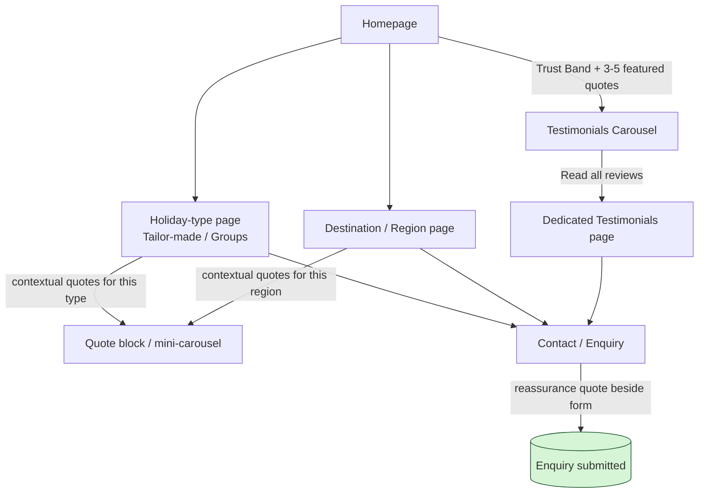
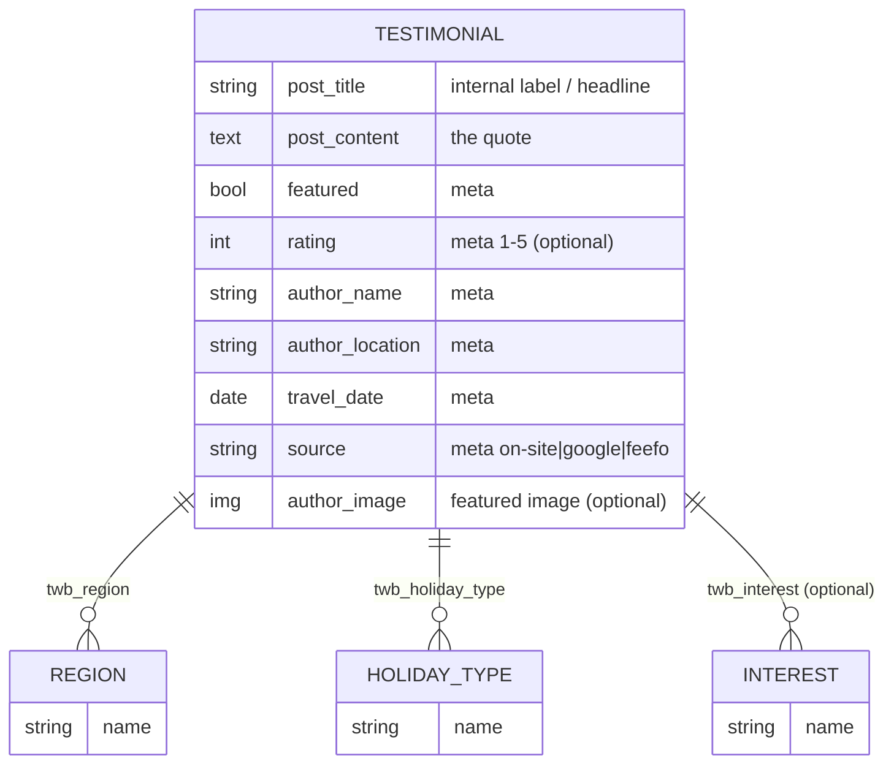
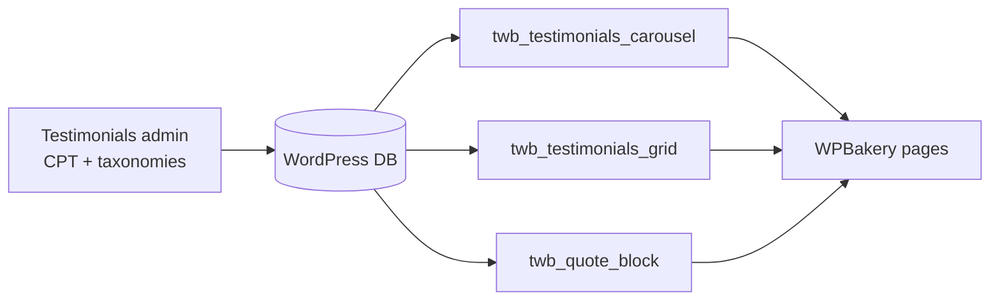
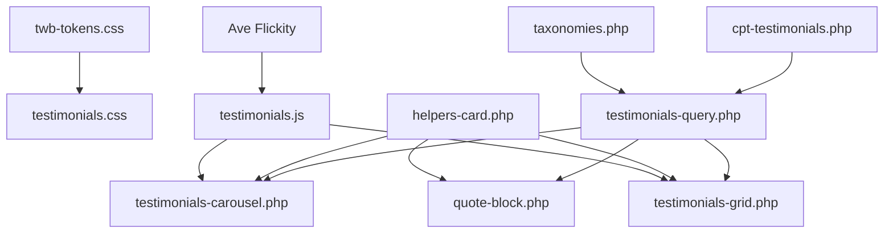
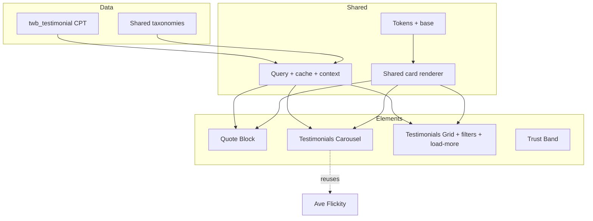

# Testimonials System — Implementation Specification

The single source of truth for building the Testimonials feature. Once approved,
implementation should follow this document directly.

- **Status:** specification (documentation only — no code, no WordPress, no WPBakery changes).
- **Foundation (do not duplicate — referenced throughout):**
  [Design System Audit](DESIGN_SYSTEM_AUDIT.md) ·
  [UX & IA Audit](UX_INFORMATION_ARCHITECTURE_AUDIT.md) ·
  [Component Architecture Audit](COMPONENT_ARCHITECTURE_AUDIT.md).
- **Reference implementation pattern:** the existing `[twb_hero_carousel]` child-theme element.
- **Decisions & build plan:** [ADR-001 — Testimonials Architecture](Architecture/ADR-001-Testimonials-Architecture.md) (the *why*) · [Testimonials Implementation Plan](TESTIMONIALS_IMPLEMENTATION_PLAN.md) (the *how* / authoritative milestones).
- **Token shorthand used below** (full values in the Design System Audit):
  `--twb-green #1E5630` · `--twb-navy #032C42` · `--twb-yellow #FED700` ·
  `--twb-sage #789964` · `--twb-text #273744` · `--twb-muted #797B86` ·
  `--twb-surface #F7F7F7` · `--twb-border #E0E0E0` · `--twb-white #FFFFFF`. Font: **Muli**.

> This spec **extends** the existing design language; it invents nothing new.

---

## 1. Feature overview

**Purpose:** introduce social proof across the site to convert the existing
trust assets (30+ years, bespoke specialism, fully protected) into visible
visitor confidence — the UX Audit's #1 priority.

| Goal type | Goals |
| --------- | ----- |
| **Business** | More enquiries; higher-quality enquiries; reinforce premium/specialist positioning; reusable asset that scales with the site |
| **User** | Reassurance that TWB is trustworthy and right for *their* trip (their destination / holiday type) before enquiring |
| **Success criteria** | (1) Testimonials appear contextually on homepage, dedicated page, destination & holiday-type pages, and Contact; (2) one CPT powers all surfaces; (3) fully WPBakery-editable; (4) scales to **hundreds** of records without redesign; (5) meets the hero's a11y/perf bar; (6) visually indistinguishable in quality from the hero carousel |
| **Future scalability** | Shared taxonomies (Region, Holiday Type) are reused by future Guides/Offers/Events; filtering/pagination components are reused beyond testimonials |

**Non-goals:** redesigning existing pages; building a public review-submission
form (future); third-party review-platform sync (future, Section 16).

---

## 2. User journey

Testimonials reinforce confidence at **every** decision point, not one page.



**Principle (from UX Audit):** conversion should get *easier* with intent —
the deeper a visitor goes, the more **contextually relevant** the proof becomes,
always paired with a path to enquire.

---

## 3. Information architecture

### Decision: **Hybrid — Custom Post Type for storage + WPBakery elements for presentation**

| Option | Verdict |
| ------ | ------- |
| Pure WPBakery content | ❌ Not reusable; same quote re-entered per page; can't filter/scale |
| Pure CPT with fixed templates | ◑ Scalable but not client-composable in the builder |
| **Hybrid (CPT + `vc_map` elements)** | ✅ **Chosen.** Authors manage *records*; page-builders drop a component and pick filters. Matches the Component Architecture Audit's data strategy and the hero pattern |

### Data model



- **CPT:** `twb_testimonial` (public, has archive optional, `show_in_rest` true for future).
- **Shared taxonomies** (registered once, reused by future CPTs):
  - `twb_region` — Bavaria, Black Forest, Rhine/Mosel/Eifel, Eastern, Northern… (mirrors the Destinations IA).
  - `twb_holiday_type` — Tailor-made, Groups, Special Interest, Events, Couples, Family…
  - `twb_interest` *(optional)* — Castles, Wine, History, Football…
- **Featured selection:** `featured` meta flag → homepage band + fallback when no contextual match.
- **Homepage selection:** query `featured = true`, ordered, limited (Section 8).
- **Future search:** CPT + `show_in_rest` + taxonomy terms enable front-end facets and keyword search later (Section 10) with no remodelling.

**Why shared taxonomies matter:** a single quote tagged `region: Bavaria`,
`holiday_type: Tailor-made` can surface on the Bavaria page, the Tailor-made
page, the testimonials page (filtered), and the homepage — **entered once**.

---

## 4. Dedicated Testimonials page structure

Assembled in WPBakery from a mix of custom elements and standard rows. Exact
top-to-bottom order:

| # | Section | Build | Purpose | Behaviour | Responsive | Future expansion |
| - | ------- | ----- | ------- | --------- | ---------- | ---------------- |
| 1 | **Page hero** (lightweight, not the carousel) | standard row / future `Hero` element | Title "What our travellers say" + short intro | Static | Reduced height on mobile | Could become an image hero |
| 2 | **Trust Band** | `[twb_trust_stats]` element | "30+ years · 60+ destinations · Fully protected" | Static; optional count-up (respects reduced-motion) | Stack to 1–2 cols | Pull numbers from Theme Options |
| 3 | **Featured testimonials** | `[twb_testimonials_carousel]` | 3–5 best quotes, prominent | Crossfade carousel (Flickity) | 1 per view mobile | Auto-rotate optional |
| 4 | **Filter bar** *(phase 2)* | part of `[twb_testimonials_grid]` | Filter by region / holiday type | Front-end facets | Collapses to dropdowns | Add search, rating, year |
| 5 | **Testimonials grid** | `[twb_testimonials_grid]` | All testimonials, paginated | Masonry/equal-height grid | 3 → 2 → 1 cols | Hundreds of records |
| 6 | **Load more / pagination** | grid sub-feature | Progressive loading | AJAX "Load more" (fallback paged links) | Full-width button | Reused by guides/blog |
| 7 | **CTA / enquiry band** | future `[twb_cta_band]` (or row) | Convert the now-reassured visitor | Static | Stack | Reuse site-wide |

ASCII wireframe (desktop):

```
┌──────────────────────────────────────────────┐
│  HERO: "What our travellers say"  + intro     │
├──────────────────────────────────────────────┤
│  TRUST BAND:  30+ yrs | 60+ dest | Protected  │  (surface #F7F7F7)
├──────────────────────────────────────────────┤
│  FEATURED  ‹  [ ★★★★★  "quote…"  — Name ]  ›   │  (carousel, fade)
│                  • • • ◦ ◦                     │
├──────────────────────────────────────────────┤
│  [ Region ▾ ] [ Holiday Type ▾ ]   (phase 2)  │
│  ┌────────┐ ┌────────┐ ┌────────┐             │
│  │ card   │ │ card   │ │ card   │   GRID      │
│  └────────┘ └────────┘ └────────┘             │
│  ┌────────┐ ┌────────┐ ┌────────┐             │
│           [   Load more   ]                   │
├──────────────────────────────────────────────┤
│  CTA BAND:  "Plan your German holiday →"       │  (green #1E5630)
└──────────────────────────────────────────────┘
```

---

## 5. Testimonial card specification

Field-level contract for the CPT and the card render.

| Field | Source | Required | Default | Limit | Fallback / empty behaviour |
| ----- | ------ | -------- | ------- | ----- | -------------------------- |
| **Quote / Review** | `post_content` | **Required** | — | ~60–400 chars (soft); cards truncate ~220 with "Read more" on the page | If empty → record not rendered |
| **Headline** | `post_title` (or `headline` meta) | Optional | first sentence of quote | ~70 chars | Hidden if absent |
| **Traveller name** | `author_name` meta | Optional | "A TWB traveller" | ~40 chars | Falls back to default label |
| **Traveller location** | `author_location` meta | Optional | — | ~40 chars | Hidden if absent |
| **Destination / Region** | `twb_region` term | Optional | — | term | Drives contextual surfacing; hidden as badge if absent |
| **Holiday type** | `twb_holiday_type` term | Optional | — | term | Hidden as badge if absent |
| **Travel date** | `travel_date` meta | Optional | — | month/year | Hidden if absent |
| **Rating** | `rating` meta (1–5) | **Optional** | none | int 1–5 | **No stars rendered if absent** (see §6 decision) |
| **Traveller image** | featured image | Optional | brand monogram/initial avatar | square | Initial-letter avatar fallback |
| **Source** | `source` meta | Optional | "on-site" | enum | Used for a small "via Google/Feefo" label later |
| **Optional CTA** | `cta_text` + `cta_link` meta | Optional | none | — | Hidden if absent |
| **Featured** | `featured` meta (bool) | Optional | false | — | Controls homepage/fallback selection |

**Card empty states:**
- No testimonials match a context → component shows **featured fallback**, or if
  none, renders **nothing** (no empty box) on contextual placements; on the
  dedicated grid shows a friendly **Empty State** ("No reviews yet for this
  filter").

ASCII card:

```
┌─────────────────────────────┐
│ ★★★★★            [Bavaria]   │  rating (optional) + region badge
│                             │
│ "Headline if present"       │  navy, bold
│ The quote text, truncated   │  body, muted
│ to a sensible length with…  │
│                             │
│ ◐ Jane D.  · Tailor-made    │  avatar + name + type
│   Travelled May 2024        │  meta, faint
└─────────────────────────────┘
```

---

## 6. Visual specification (extends the Design System Audit)

| Property | Specification |
| -------- | ------------- |
| **Container / width** | Boxed ~1170px; full-bleed band backgrounds where the section uses one (hero pattern) |
| **Spacing** | Use the **8/16/24/32/48/64/80** scale (Design Audit recommendation). Card padding 24–32px; grid gap 24–32px; section padding follows the 70–85px site rhythm |
| **Typography** | Muli. Quote 18px/1.7 (#273744); headline 18–20px/700 (#032C42 navy); name 16px/700; meta 14px (#797B86). No new fonts |
| **Colours** | Card surface `--twb-white` on `--twb-surface` sections; badges in `--twb-green`/`--twb-sage`; stars `--twb-yellow`; accents `--twb-green`/`--twb-yellow` |
| **Radius** | **0 (square)** to match the site's flat card language — *unless* the project elects the hero's softened premium direction; **default = square** for consistency |
| **Borders** | Hairline `--twb-border #E0E0E0` (or borderless on surface) |
| **Elevation** | Match tour cards: shadow on hover `rgba(0,0,0,0.15)`, transition `box-shadow 0.45s cubic-bezier(0.32,0.98,0.37,1)` |
| **Animations** | Carousel = **crossfade** like the hero (flickity-fade), autoplay optional 5–6s, caption/quote fade ~300ms `cubic-bezier(0.4,0,0.2,1)` |
| **Hover** | Card → shadow lift only (no scale), matching existing cards |
| **Image treatment** | Square avatar, `object-fit:cover`, initial-letter fallback; lazy-loaded |
| **Badge styling** | Small uppercase pill, 12–13px, letter-spacing ~0.05em, green/sage on light — consistent with existing uppercase UI labels |
| **Star rating** | Five glyphs in `--twb-yellow` (filled) / `--twb-border` (empty); accessible label "Rated X out of 5" |

### Design decision — stars vs quote-led
A bespoke, premium brand can look *transactional* with prominent star counts.
**Decision:** support rating but make it **optional and secondary** — quotes and
attribution lead; stars appear only when a record has a rating, rendered subtly.
This keeps the premium tone while allowing star proof where useful. (Documented
so implementation doesn't force stars.)

---

## 7. Responsive behaviour

| Breakpoint | Grid | Spacing | Type | Touch / images / controls |
| ---------- | ---- | ------- | ---- | ------------------------- |
| **Desktop** (≥1200) | 3 columns | 32px gaps | full scale | arrows + dots; hover shadow |
| **Laptop** (~1024–1199) | 3 → 2 columns | 24–32px | full | arrows + dots |
| **Tablet** (≤~992) | 2 columns; carousel 1 per view | 24px | slightly reduced | larger touch targets; drag enabled |
| **Mobile** (≤767) | 1 column | 16–24px | quote ~16px | **44px** min touch targets (arrows/filters/load-more); avatars smaller; filters collapse to dropdowns |

- **Filtering (mobile):** facet chips collapse into a dropdown / accordion.
- **Pagination (mobile):** full-width "Load more" button.
- **Carousel (mobile):** one card per view, swipe + dots; arrows shrink to 44px (hero pattern).
- Respect `prefers-reduced-motion` (disable autoplay + transitions).

---

## 8. Homepage integration

Per the UX Audit (no social proof in the first screens today).

| Aspect | Specification |
| ------ | ------------- |
| **Position** | A **Trust Band** + **Testimonials Carousel** placed **high** (after the intro / "who we are", before deep destination routing) |
| **Layout** | Carousel (not grid) — premium, compact, on-brand with the hero |
| **Number** | 3–5 **featured** testimonials |
| **Carousel vs grid** | **Carousel** on homepage; grid is reserved for the dedicated page |
| **Navigation** | Arrows + dots, hero interaction language; autoplay optional |
| **CTA** | "Read all reviews →" linking to the dedicated Testimonials page |
| **Relationship to page** | Homepage shows *featured subset*; "Read all" → full filterable page |

```
Home ▸ … intro … ▸ [TRUST BAND] ▸ [FEATURED TESTIMONIALS CAROUSEL] ▸ "Read all reviews →" ▸ … destinations …
```

---

## 9. Destination & holiday-type integration

| Surface | Component | Query logic | Fallback |
| ------- | --------- | ----------- | -------- |
| **Destination / region page** | `[twb_testimonials_carousel]` or Quote Block | `twb_region = <current page's region>` | If none → featured; if still none → render nothing |
| **Holiday-type page** (Tailor-made, Groups, Special Interest) | Quote Block / mini-carousel | `twb_holiday_type = <this type>` | featured → nothing |
| **Future landing pages** | element with explicit term param | author selects region/type in WPBakery, **or** auto-detect from page context | featured → nothing |

- **Automatic filtering:** the element accepts a "Context" mode that reads the
  current page's primary `twb_region`/`twb_holiday_type` term; or a manual term
  selector for editorial control.
- **Related testimonials / contextual recommendations:** same taxonomy match,
  ordered featured-first then newest.
- **Fallback chain:** contextual → featured → (suppress section). Never show an
  empty box on a contextual placement.

---

## 10. Filtering strategy (long-term — not implemented now)

| Filter | Phase | Source |
| ------ | ----- | ------ |
| **Destination / Region** | Phase 2 | `twb_region` |
| **Holiday Type / Travel Style** | Phase 2 | `twb_holiday_type` |
| **Featured / Newest** | Phase 1 (sort, not facet) | meta / date |
| **Rating** | Phase 3 | `rating` meta |
| **Year** | Phase 3 | `travel_date` meta |
| **Country** | only if expanding beyond Germany | future taxonomy |
| **Keyword search** | Phase 3 | REST + JS |

**Recommended approach:** ship the grid **unfiltered** first (just featured-first
ordering + load-more). Add **taxonomy facets (region, holiday type)** in Phase 2
as progressive enhancement (works as paged links without JS; AJAX-enhanced with
JS). Add rating/year/search in Phase 3. Build the **filter + pagination as
reusable list components** so guides/blog reuse them.

---

## 11. Performance

| Concern | Specification |
| ------- | ------------- |
| **Query limits** | Homepage/contextual: `posts_per_page` 3–6, `no_found_rows` true; grid: page size 9–12 |
| **Pagination** | Load-more (AJAX) with paged-link fallback; never load all records at once |
| **Lazy loading** | Avatars `loading="lazy"`; first carousel slide may be eager (hero pattern) |
| **Image optimisation** | Square avatar size registered (e.g. 160×160) via `add_image_size`; serve that, not full |
| **Caching** | Cache featured/contextual query results in **transients** keyed by term; bust on testimonial save (`save_post_twb_testimonial`) |
| **Asset loading** | Enqueue testimonial CSS/JS **only when an element renders** (hero pattern); reuse bundled **Flickity** (no new libs); `filemtime` versioning |
| **Layout shift** | Reserve card/media heights; `adaptiveHeight` carefully; avoid CLS like the hero |
| **Accessibility cost** | No heavy JS; progressive enhancement so content exists without JS |
| **Future-proofing** | `show_in_rest` enables a future headless/AJAX facet UI without re-modelling |

---

## 12. WPBakery strategy

| Build as **custom `vc_map` element** | Keep as **standard rows/columns** |
| --- | --- |
| `[twb_testimonials_carousel]` · `[twb_testimonials_grid]` (incl. filters + load-more) · `[twb_quote_block]` (single) · `[twb_trust_stats]` | Page hero text, CTA band (until a shared element exists), section spacing |

**Shared options (every testimonial element):**
- **Source mode:** Featured · By Region · By Holiday Type · Context (auto from page) · Manual selection.
- **Count / page size**, **order** (featured-first / newest / rating).
- **Show rating?** (on/off), **Show avatar?**, **Show badges?**.
- **Section options** (shared with all TWB elements): background (white/surface/green), spacing from token scale, container width, heading set, anchor.

**Editor experience / workflow:**
1. Author adds testimonials under **Testimonials** admin menu (taxonomies in the sidebar).
2. On any page, drop a TWB testimonial element (under the **"Travel Without Borders"** category) and choose Source mode + display options.
3. No HTML/CSS needed; all client-editable. Registered under the existing TWB element category to minimise editor clutter.



---

## 13. Development architecture (intended — no code here)

Follows the Component Architecture Audit standards and the hero pattern.

### Files (child theme `07_Source/Themes/ave-child/`)

```
inc/
  cpt-testimonials.php        # register twb_testimonial CPT + meta
  taxonomies.php              # shared: twb_region, twb_holiday_type, twb_interest
  testimonials-query.php      # query helpers + transient caching + context detection
  testimonials-carousel.php   # vc_map + render: [twb_testimonials_carousel]
  testimonials-grid.php       # vc_map + render: [twb_testimonials_grid] (+ load-more handler)
  quote-block.php             # vc_map + render: [twb_quote_block]
  trust-stats.php             # vc_map + render: [twb_trust_stats]
  helpers-card.php            # shared card render (used by all three)
assets/
  css/
    twb-tokens.css            # shared tokens (created in Foundation phase)
    testimonials.css          # component styles
  js/
    testimonials.js           # Flickity init (reuse) + load-more/filter enhancement
```

`functions.php` stays thin: `require` the `inc/*` files, register shared assets,
`filemtime` versioning, register the AJAX action for load-more.

### Templates
- Presentation lives in **render callbacks** (like the hero), not page templates.
- A single **shared card renderer** (`helpers-card.php`) renders the testimonial
  card for carousel, grid and quote contexts (DRY).

### CSS / JS organisation
- BEM + `twb-` prefix: `.twb-testimonials`, `.twb-testimonial-card__quote`,
  `--featured` modifiers. Reference `var(--twb-*)`; no inline CSS.
- One testimonials JS file; reuse bundled Flickity; guard single-init; AJAX
  load-more progressively enhances paged links.

### Hooks / filters (extensibility)
- `twb_testimonials_query_args` (filter the WP_Query args).
- `twb_testimonial_card_fields` (filter rendered fields).
- `twb_testimonials_cache_ttl` (filter transient TTL).
- Actions on `save_post_twb_testimonial` to bust caches.

### Naming conventions
- Prefix everything `twb_` (PHP), `.twb-` (CSS), `twb-testimonial` (CPT), `twb_region` (taxonomy).

### Dependency relationships



---

## 14. Accessibility

Carry the hero's standard forward.

| Aspect | Requirement |
| ------ | ----------- |
| **Semantic HTML** | Each testimonial = `<figure>` with `<blockquote>` (quote) + `<figcaption>` (attribution + `<cite>` for name). Star rating has a text equivalent |
| **Headings** | Page: one `<h1>`; section headings `<h2>`; cards do **not** use headings for quotes (use blockquote), avoiding hierarchy noise |
| **Keyboard** | Carousel focusable (`tabindex=0`), arrow-key nav; arrows/dots/filters/load-more are real `<button>`s, tab-reachable & operable |
| **ARIA** | Carousel arrows `aria-label` Previous/Next; live region announces slide/load changes politely; filter controls labelled; avatar `alt` or decorative `alt=""` with text attribution present |
| **Focus states** | Visible `:focus-visible` ring in `--twb-yellow` (hero pattern) on all interactive parts |
| **Screen reader** | Reads "Quote: … figure caption: Name, location, Tailor-made, Bavaria, rated 5 of 5" coherently |
| **Reduced motion** | `prefers-reduced-motion` disables autoplay + transitions; load-more still works |
| **Colour contrast** | Body/quote text and badges meet **WCAG AA** (≥4.5:1); verify badge text on green; stars are supplementary (not sole meaning) |

---

## 15. Acceptance criteria

Implementation is complete when **all** hold:

- **Visual consistency:** matches the Design System Audit tokens; reads as the same quality tier as the hero; no new fonts/colours; square-card language (unless the softened direction is explicitly approved).
- **Responsive:** correct grid/spacing/type at desktop/laptop/tablet/mobile; 44px touch targets; no horizontal scroll; verified in Playwright at ≥3 widths.
- **Accessibility:** semantics, keyboard, ARIA, focus rings, reduced-motion, AA contrast all met; verified with a screen-reader pass.
- **Performance:** asset-on-demand loading; bundled Flickity reused; queries limited + cached; no CLS; lazy avatars.
- **WPBakery usability:** all three elements + trust band editable by the client; source modes work (featured/region/type/context/manual); registered under the TWB category.
- **Data integrity:** CPT + shared taxonomies registered; fallback chain (contextual → featured → suppress) verified; empty states correct.
- **Maintainability:** BEM/`twb-` naming; shared card renderer (no duplication); tokens referenced; thin `functions.php`.
- **Documentation:** components documented; CHANGELOG/DEVELOPMENT_LOG updated in the same change.
- **Testing:** desktop/tablet/mobile screenshots; interaction QA (carousel, filters, load-more); 0 console errors; 0 PHP warnings.
- **Git workflow:** built in `07_Source/Themes/ave-child/` (junctioned); small, reviewable, reversible commits; nothing outside the child theme tracked.

---

## 16. Implementation roadmap

Milestone sequencing is owned by the **authoritative
[Testimonials Implementation Plan](TESTIMONIALS_IMPLEMENTATION_PLAN.md)** — refer
there for the canonical milestone list, dependency graph, Git graph, testing
sequence and release checklist. (That plan separates **infrastructure** and the
**shared design foundation** into their own milestones before feature work, so its
numbering is M1–M12; this spec does not restate it to avoid divergence.)

High-level sequence (see the plan for detail):

`Infrastructure (loader) → Shared design foundation (tokens) → Data layer (CPT + shared taxonomies) → Shared card renderer + query helpers → Quote Block → Carousel → Homepage (Trust Band + carousel) → Grid + Load More → Dedicated page → Destination/type integration → Filtering → Polish & docs.`

---

## Component hierarchy (this feature)



---

## Decision rationale (summary)

| Decision | Rationale |
| -------- | --------- |
| Hybrid CPT + WPBakery elements | Reuse-once data + client-composable presentation; scales to hundreds; matches Component Architecture Audit |
| Shared taxonomies (Region, Holiday Type) | Contextual reuse across destination/type/homepage; reused by future Guides/Offers/Events |
| Carousel on homepage, grid on page | Premium compact proof up top; exhaustive browsing on the dedicated page |
| Stars optional & secondary | Preserve premium/bespoke tone; avoid transactional feel while allowing proof |
| Square cards by default | Consistency with the existing flat card language (no new visual language) |
| Reuse Flickity, asset-on-demand, filemtime | Performance + zero new dependencies; mirrors the proven hero pattern |
| Build smallest element first (Quote Block) | Reviewable, reversible increments; de-risks the shared card early |

## Future considerations
- Third-party review sync (Google/Feefo/Trustpilot) → map to `source`; show platform badge + aggregate rating.
- Public submission form (moderated) feeding the CPT.
- Reuse the **filter + load-more + empty-state** components for **Travel Guides** and **Blog**.
- Aggregate rating schema (`Review`/`AggregateRating` structured data) for SEO once ratings exist.

> Specification only. No code written, nothing on the site changed. This is the
> single source of truth for implementing the Testimonials system; update it if
> decisions change during the build.
