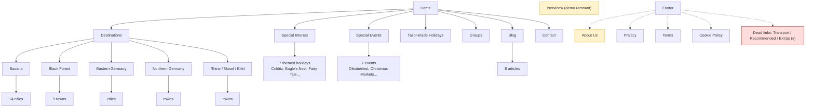
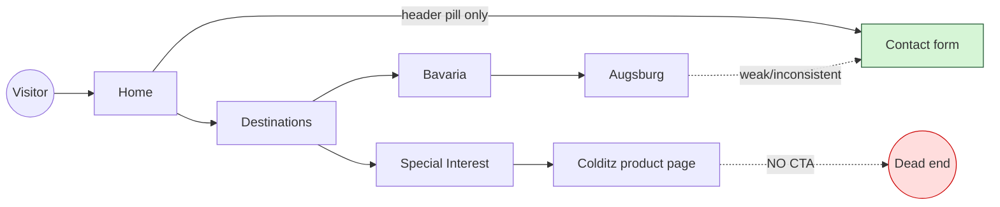

# UX & Information Architecture Audit — Travel Without Borders

A strategic review of **how the website communicates with visitors and guides
them toward an enquiry** — analysed as a first-time customer planning a German
holiday. Companion to the [Design System Audit](DESIGN_SYSTEM_AUDIT.md); this
document deliberately does **not** repeat typography, colour, spacing or
component measurements.

- **Audited:** 2026-06-26 · LocalWP (`http://travelwithoutborders.local`)
- **Lens:** UX designer · CRO specialist · travel-website consultant · product designer
- **Scope:** documentation/strategy only — no code, WordPress, or WPBakery changes.
- **Evidence:** crawled the live IA (87 published pages, 8 posts), profiled 11 key page templates, and inspected menus, CTAs, trust signals and conversion paths.

---

## Executive summary

Travel Without Borders has **strong, differentiated raw material** — a genuine
specialist (bespoke, made-to-measure holidays to Germany, 30 years' experience),
deep destination coverage, and a now-premium homepage hero. But the site
**under-sells its strengths and leaks conversions**:

1. **The journey dead-ends.** Visitors drill deep into destinations / special
   interests, then find **no contextual way to enquire** — some product pages
   (e.g. Colditz) have *zero* conversion links in their content.
2. **Trust is hidden.** The best trust content ("**over 30 years' experience**",
   "**Fully protected — book with confidence**") lives on an **About page that
   isn't in the main navigation**. There are **no testimonials anywhere**.
3. **The enquiry path relies on one header button.** "Contact" in the header is
   doing almost all the conversion work; the hero and most sections have no CTA.
4. **Orphans & dead links erode polish.** A leftover theme-demo page (`/services/`
   = "Tours"), an unlinked About page, three footer links that go to `#`, and
   duplicated homepage content.
5. **No breadcrumbs** on a site that is **3–4 levels deep**, hurting orientation
   and SEO.

None of these require a visual redesign — they are **information architecture,
content placement and conversion-path** fixes. The prioritised roadmap is in
Section 14.

---

## 1. Homepage communication

| Question | Verdict | Evidence |
| -------- | ------- | -------- |
| Value proposition immediately clear? | **Partly.** The hero shows beautiful German destinations but **no headline or CTA** — it's atmosphere, not message. The proposition ("bespoke holidays to Germany") only appears in the *second* section. | Hero slides carry titles (Berlin, Bavaria…) but no value statement or button. |
| Who is the company? | Stated in section 2 ("an experienced travel planner specialising in tailor-made… holidays to Germany"). | H1 in intro row. |
| What do they specialise in? | **Clear once you scroll:** tailor-made & special-interest holidays to Germany, independent travellers + private groups. | Intro + "How can we help". |
| What makes them different? | **Weak.** "Bespoke" and "specialist" are stated but not *proven* — the 30-years / fully-protected proof points are absent from the homepage. | Trust content lives only on `/about/`. |
| Trust established quickly? | **No.** No testimonials, no accreditation, no experience stat above the fold. | Homepage trust scan = none. |
| CTAs obvious? | **No.** Primary action is the header "Contact" pill. The hero has no CTA; most sections use "Learn More" (scrolls/links) not "Enquire". One "Enquire Now" appears far down on a single "Berlin Burlesque" feature. | CTA census: Learn More ×7, Enquire ×1. |
| Clear visual hierarchy? | The top bar tagline → hero → intro flow is reasonable, but the **narrative drifts** mid-page (a duplicated row, a single oddly-specific event feature). | See Section 7. |

**First-time-visitor confusion risks:**
- The hero looks like a gallery, not a value statement — a visitor may not learn *what the company does* until they scroll.
- "Learn More" buttons that scroll within the page can feel like dead clicks.
- The lone "Berlin Burlesque" feature implies a promotion the rest of the site doesn't support.

---

## 2. Navigation & information architecture

### Primary navigation (header)
`Home · Destinations · Special Interest · Special Events · Tailor-made Holidays · Groups · Blog · Contact`

- **Destinations** is a **60-item mega-menu** — four regions (Bavaria, Black
  Forest, Eastern, Northern, Rhine/Mosel/Eifel) each expanding to many cities.
  Comprehensive but **overwhelming**; no visual grouping cues beyond region rows.
- **Special Interest** (7 themes) and **Special Events** (7) are well-scoped.
- **Tailor-made** and **Groups** are the core commercial offers but sit *after*
  the destination/interest menus.

### Secondary / footer navigation
- Footer repeats the main sections + adds **About Us**, **Privacy**, **Terms**,
  **Cookie Policy**, and a column of latest blog posts.
- **Three dead links** point to `#`: **Transport Options**, **Recommended
  Links**, **Travel Extras** — visible promises with no destination.

### Internal linking
- Homepage and region pages link *down* into destinations well.
- **Deep pages rarely link *across or back to conversion*** — see Section 5.

### Breadcrumbs
- **None anywhere.** On a site nested 3–4 levels deep (Destinations → Bavaria →
  Augsburg), this is a notable orientation and SEO gap.

### IA problems identified
| Issue | Detail |
| ----- | ------ |
| **Orphan: About** | `/about/` holds the best trust content but is **not in the primary nav** (footer-only). |
| **Orphan / demo remnant: Services** | `/services/` (title "**Tours**", sections "Top Destinations / Ultimate Experiences / **Subscribe Newsletter**") looks like leftover **Ave theme demo content**; published but unlinked. Recommend review → unpublish/redirect. |
| **Duplicate page concepts** | Two privacy-style pages: `twb-privacy-policy` *and* `cookie-policy`. |
| **Duplicated homepage content** | The "Wide choice of options for the independent traveller" section renders **twice**. |
| **Dead footer links** | Transport Options / Recommended Links / Travel Extras → `#`. |
| **No "Why choose us" / trust hub** | 30-years / protection story has no home in the main IA. |

### Current sitemap (as built)

---

## 3. Content hierarchy (per major template)

| Page | Heading order | Issue |
| ---- | ------------- | ----- |
| Home | H1 (intro) after the hero; 21× H2 (incl. carousel titles) | Value prop not in the first heading; many H2s are slide titles |
| About | **Two H1s** ("About TWB" + "Fully protected…") | Invalid hierarchy; dilutes the page topic |
| Tailor-made | H1 only, **no H2 subheads**, ~1,800 words | Long wall of text; poor scanability |
| Groups | H1 + 1 H2 | Acceptable |
| Destinations | H1 + 3 logical H2s (What to do / How we help / Regions) | **Best-structured page** |
| Region (Bavaria) | H1 + 1 H2 | Mostly card links; thin narrative |
| Special Interest / Events landings | H1 only, **no H2** | Thin (~700 words), flat |
| Contact | **No H1, no H2** | Heading hierarchy missing entirely |

**Pattern:** content order is generally logical top-to-bottom, but **heading
hierarchy is inconsistent** (missing H1/H2s on key pages, double H1 on About),
and the **highest-intent pages (Tailor-made, Contact) are the least scannable**.

---

## 4. Trust building

| Trust signal | Present? | Where | Prominence |
| ------------ | -------- | ----- | ---------- |
| Years of experience ("**30+ years**") | ✅ exists | **About only** | **Hidden** (About not in nav) |
| Financial protection ("**Fully protected — book with confidence**") | ✅ exists | About only | Hidden |
| Breadth of destinations (60+ places) | ✅ implied | Mega-menu / Destinations | Medium (not framed as a *stat*) |
| Testimonials / reviews | ❌ **none** | — | — |
| Star ratings (Trustpilot/Feefo/Google) | ❌ none | — | — |
| Awards / press | ⚠️ partial | A "John Sergeant…Colditz" blog post (PR-ish) | Buried in blog |
| Accreditations (ABTA/ATOL/AITO logos) | ❌ none visible | — | — |
| Partner logos | ❌ none | — | — |

**Verdict:** the company has **genuinely strong trust assets** (three decades,
financial protection, a specialist niche) but they are **invisible in the
journey**. This is the single biggest, cheapest win available.

---

## 5. Calls to action

| CTA | Wording | Placement | Notes |
| --- | ------- | --------- | ----- |
| Header pill | **"Contact"** | Every page header | **Carries nearly all conversion**; generic wording ("Contact" < "Plan my holiday" / "Start your enquiry") |
| Hero | *(none)* | Homepage hero | **Missed** — the most-viewed real estate has no CTA |
| Section CTAs | "Learn More", "Our Destinations", "Our Special Interest Holidays" | Homepage | **Navigational, not conversion** (scroll/link) |
| "Enquire Now" | strong | One homepage feature + Tailor-made | Rare; not repeated |
| Inline "Contact us" | weak | *Some* city pages (Augsburg) | **Inconsistent** — missing on others (Colditz: none) |
| Forms | Quform | **Only Contact, Tailor-made** (+ demo Services) | Region/interest/event pages have **no form** |

**Dead-end map (where visitors get stuck):**

**Core problem:** the deeper and more *interested* a visitor gets, the **harder
it becomes to enquire**. Conversion should get *easier* with intent, not harder.

---

## 6. Page-by-page UX review (prioritised by impact)

### Homepage — *impact: Critical*
- **Purpose:** orient + route + convert.
- **Strengths:** premium hero; clear specialism once scrolled; good destination/interest routing; fresh blog presence.
- **Weaknesses:** no hero CTA/headline; trust absent above the fold; duplicated section; a single off-narrative "Berlin Burlesque" feature; "Learn More" overuse.
- **Missed opportunities:** social proof band; "30 years / fully protected" strip; a single strong "Start your enquiry" CTA repeated down the page.
- **Recommend:** add a hero value line + primary CTA; insert a trust/testimonial band high up; de-duplicate; replace the lone event feature with a coherent "Ways to travel" (Tailor-made / Groups / Special Interest) router.

### Contact — *impact: Critical*
- **Purpose:** capture enquiries.
- **Strengths:** form present; concise.
- **Weaknesses:** **no H1/H2**; off-brand Quform styling (see Design audit); no reassurance (response time, privacy, "no obligation"), no trust near the form.
- **Recommend:** add heading + supportive microcopy + trust cues beside the form.

### Tailor-made Holidays — *impact: High*
- **Purpose:** explain + convert the core offer.
- **Strengths:** form present; strong intent page; trust language.
- **Weaknesses:** ~1,800 words with **no subheadings**; hard to scan; CTA buried.
- **Recommend:** add H2 structure (How it works · What's included · Pricing approach · Enquire); add a step/flow visual; surface the form earlier.

### Destinations (hub) — *impact: High*
- **Strengths:** **best-structured page** (clear H2s, "How we can help").
- **Weaknesses:** no enquiry CTA; ends by sending users deeper without a conversion option.
- **Recommend:** add an "Enquire about any destination" CTA; add region intros.

### Region & City pages (Bavaria → Augsburg …) — *impact: High (volume)*
- **Purpose:** inspire + inform per place.
- **Weaknesses:** **no/inconsistent enquiry CTA**, **no breadcrumbs**, thin narrative on some; card grids link ever-deeper.
- **Recommend:** a **standard contextual CTA block** ("Enquire about a Bavaria holiday") + breadcrumbs on every destination page (template-level, high leverage).

### Special Interest / Events (landings + products) — *impact: High*
- **Weaknesses:** thin landings (~700 words, no H2); **product pages can dead-end** (Colditz: no CTA).
- **Recommend:** consistent product template with an enquiry CTA; richer landing intros.

### Groups — *impact: Medium*
- **Strengths:** good persuasive copy + trust ("professionalism is our main asset").
- **Weaknesses:** **no form** (relies on Contact); no group-specific capture.
- **Recommend:** add a group enquiry CTA/form.

### About — *impact: High (mis-placed asset)*
- **Strengths:** the **richest trust content** (30 years, protection, story).
- **Weaknesses:** **not in primary nav**; double H1; no CTA.
- **Recommend:** add to primary nav (or a "Why us" entry); fix headings; add CTA; feed snippets to the homepage.

### Blog — *impact: Medium*
- **Strengths:** 8 genuinely useful, inspirational articles; surfaced on homepage + footer.
- **Weaknesses:** no related-content or "plan this trip" CTA at article end; no categories/guides structure.
- **Recommend:** end-of-article CTA + light categorisation (see Section 9).

### `/services/` ("Tours") — *impact: cleanup*
- **Verdict:** **theme-demo remnant** (generic "Top Destinations / Subscribe Newsletter"); orphaned. **Review → unpublish or redirect.**

---

## 7. Homepage layout analysis (section by section)

| # | Section | Why it exists | Earns its place? | Recommendation |
| - | ------- | ------------- | ---------------- | -------------- |
| 1 | **Hero carousel** | Atmosphere / destinations | Partly — gorgeous but no message/CTA | **Add a value headline + primary CTA** (keep the design) |
| 2 | **Intro + "Learn More"** | States who/what | Yes | Tighten; point CTA at enquiry, not scroll |
| 3 | **"How can we help?"** (grey) | Routes by interest, SEO links | Yes | Keep; could become visual routers |
| 4 | **"Germany" intro** | Sells the destination | Partly (generic) | Shorten or merge with #2 |
| 5 | **Destinations grid** | Routes to regions | Yes — strong | Keep; add enquiry CTA after |
| 6–7 | **"Independent traveller" (×2)** | Audience framing | **No — duplicated** | **De-duplicate**; keep one |
| 8 | **Special Interest carousel** | Routes to themes | Yes | Keep |
| 9 | **(empty/decorative row)** | — | No | Remove |
| 10 | **"Berlin Burlesque" + Enquire** | A single featured product | **No — off-narrative** | Replace with a "Ways to travel" router (Tailor-made/Groups/Special Interest) |
| 11 | **Special Events carousel** | Routes to events | Yes | Keep |
| 12 | **Blog grid** | Freshness + SEO + inspiration | Yes | Add "plan this" CTA |
| 13 | **Email/contact strip** (green) | Conversion | Yes but weak | Strengthen into a proper enquiry CTA band |

**Narrative flow verdict:** the top third is coherent (hero → who we are → how we
help → destinations). The **middle wanders** (duplicate row, decorative gap, a
one-off product feature) before recovering with events/blog/contact. **Missing
entirely:** a **trust/social-proof band** and a **single, repeated primary CTA**.

**Proposed narrative (no redesign — re-sequencing only):**
`Hero (+CTA) → Who we are → Trust/social proof → How we help (interests) → Destinations → Ways to travel (Tailor-made/Groups/Special Interest) → Events → Blog → Strong enquiry band.`

---

## 8. Testimonials — where they'd have the most impact

There are **no testimonials anywhere today**, so this is greenfield. Recommended
long-term strategy, by leverage:

| Location | Impact | Rationale |
| -------- | ------ | --------- |
| **Homepage trust band** (high, above mid-page) | ★★★★★ | First-impression credibility; currently zero social proof in the first screens |
| **Contact page** (beside the form) | ★★★★★ | Reduces friction at the decision point |
| **Tailor-made & Groups pages** | ★★★★☆ | High-intent; reassurance where money/commitment is considered |
| **Destination/region pages** | ★★★★☆ | "A real customer's Bavaria trip" — contextual proof at volume |
| **Footer** (rotating quote) | ★★★☆☆ | Site-wide ambient trust |
| **Sidebar** (where present) | ★★☆☆☆ | Lower priority; layout-dependent |

**Strategy:**
- Build testimonials as a **reusable, taggable content type** (e.g. tag by
  region / holiday type) so the *same* quotes can surface contextually on
  destination and product pages — not just a single static page.
- Pair quotes with **attribution + trip type** (e.g. "Tailor-made, Bavaria, 2024").
- Feed 2–3 into the **homepage trust band** and the **Contact** sidebar.
- Long-term: connect to a third-party review platform (Google/Trustpilot/Feefo)
  for star ratings + freshness, then mirror on-site.

(Design of the component is out of scope here — see future Testimonials task.)

---

## 9. Content gaps (ranked)

| Rank | Gap | Why a traveller expects it |
| ---- | --- | -------------------------- |
| 1 | **Testimonials / customer stories** | Social proof is table-stakes for booking a bespoke trip |
| 2 | **"How it works" / booking process** | Bespoke buyers need to understand the steps & commitment before enquiring |
| 3 | **Pricing guidance / "from" framing** | Absence of *any* price signal creates hesitation ("can I afford this?") |
| 4 | **FAQs** | Protection, payment, ATOL/ABTA, flights, changes, COVID/insurance |
| 5 | **Trust/credentials hub ("Why us")** | The 30-years / protection story needs a front-door home |
| 6 | **Holiday *types* framing** | Users think in "family / couples / luxury / adventure"; site is organised by *place*, not *trip type* |
| 7 | **Planning advice / travel tips / guides** | Blog hints at this but it isn't structured as guides |
| 8 | **Destination inspiration formats** | Itineraries / sample trips ("7 days in Bavaria") |
| 9 | **Meet the team / human face** | Bespoke = relationship; a named, human planner builds confidence |

---

## 10. Content accessibility & readability

(Distinct from the technical a11y covered in the Design System Audit.)

| Factor | Finding |
| ------ | ------- |
| Reading difficulty | Generally friendly, conversational tone — appropriate for the audience |
| Paragraph length | **Long blocks** on Tailor-made/About; benefit from breaking up |
| Heading hierarchy (content sense) | **Inconsistent** — missing H1/H2s on Contact & Tailor-made; double H1 on About hurts scanning |
| CTA clarity (wording) | "Learn More" is ambiguous; "Contact" is generic; intent-led labels would read clearer |
| Scanability | **Weak on the highest-intent pages** (walls of text, few subheads, no bullet summaries) |
| Mobile reading | Long fixed-padding sections + long paragraphs = heavy scrolling; the homepage is **very long** on mobile |

**Recommendations:** add subheadings + short paragraphs + bullet summaries to
Tailor-made/About/Groups; replace ambiguous CTAs with intent-led wording;
consider trimming homepage length on mobile.

---

## 11. SEO content structure (no keyword research)

| Aspect | Finding | Structural improvement |
| ------ | ------- | ---------------------- |
| Page titles | **Good** — descriptive, brand-suffixed, keyword-aware ("Bavaria Holidays \| … \| Independent & Private Groups") | Keep the pattern |
| Heading structure | **Inconsistent** (missing/duplicate H1s; thin H2 usage) | One H1 per page; add logical H2s on Contact, Tailor-made, landings |
| Content depth | Hubs solid (~1,000–1,800 words); **thin landings** (~700) and some city pages | Deepen Special Interest/Events landings; add unique intros to region/city pages |
| Duplicate messaging | Repeated "Wide choice of…" phrasing across home + region pages; duplicated homepage row | De-duplicate; vary region intros |
| Internal linking | Good *downward*; **weak lateral & upward** (no breadcrumbs, few "related" links) | **Add breadcrumbs site-wide**; add related-destination & related-article links |
| Orphans | About (valuable) + Services (demo) unlinked | Link About; remove/redirect Services |

> Adding **breadcrumbs** and fixing **heading hierarchy** are the two highest-value,
> lowest-risk SEO-structural moves — and both also improve UX.

---

## 12. Competitor positioning (from the experience alone)

| Question | Answer from the site |
| -------- | -------------------- |
| What type of company? | A **specialist, independent bespoke tour operator / travel planner** focused exclusively on Germany. |
| Target market? | **Specialist + experiential** travellers: independent travellers and **private groups** wanting tailor-made, interest-led trips (history, castles, wine, events). |
| Luxury? | **Premium-leaning but ambiguous.** The new hero feels premium; copy says "bespoke/tailor-made", but there's **no luxury framing, no pricing, no high-end proof** (testimonials/awards). |
| Budget? | No — nothing signals budget. |
| Adventure / Family? | Not explicitly; some special-interest (football camps, motoring) hints at niches but no family framing. |
| **Obvious to a first-timer?** | **"Germany specialist" — yes, quickly. "Premium bespoke, trustworthy, for me" — not reliably.** |

**Why the premium/specialist positioning isn't fully landing:** the
differentiators (30 years, protection, genuine bespoke service, breadth) are
**told late and quietly**, with **no social proof** and **no clear sense of the
service experience or value**. The site reads as *competent and comprehensive*
rather than *premium and reassuring*.

---

## 13. Future scalability

Can the current IA absorb new content without a redesign?

| Future addition | Fits today? | Recommendation |
| --------------- | ----------- | -------------- |
| **Testimonials** | ⚠️ no home | Build as a **taggable content type** + reusable component; surface contextually (Section 8) |
| **Travel Guides** | ⚠️ blog only | Add a **Guides** section (or blog categories) distinct from news posts |
| **Blog** | ✅ exists | Add **categories/tags** for scale (currently a flat list of 8) |
| **Destinations** | ✅ strong | Keep; add breadcrumbs + region landing intros; consider mega-menu grouping UI |
| **Holiday Types** | ❌ missing axis | Introduce a **"Holiday Types" navigation axis** (family/couples/luxury/groups) cross-cutting destinations |
| **FAQs** | ❌ none | Add an FAQ template (also strong for SEO) |
| **Special Offers** | ❌ none | Needs a home if introduced; avoid one-off homepage features (cf. "Berlin Burlesque") |
| **Customer Stories** | ❌ none | Pair with testimonials as long-form proof |

**Structural recommendations to minimise future redesign work:**
1. Establish a **reusable component library in the child theme** (WPBakery
   `vc_map` elements) — testimonial block, CTA/enquiry band, trust strip,
   breadcrumb — so new pages assemble from proven parts.
2. Introduce a **second navigation axis ("Holiday Types")** alongside
   destinations, so growth doesn't bloat the 60-item destinations menu.
3. Treat **CTA / trust / testimonial bands as templated includes**, not
   per-page hand-builds, so they appear consistently as the site grows.
4. Add **breadcrumbs + categories** now, while the content set is small.

---

## 14. Priority improvement roadmap

> Effort = rough build effort within the established child-theme + WPBakery workflow.
> None of these are visual redesigns; all are IA / content / conversion changes.

### 🔴 Critical

| # | Problem | Why it matters | User benefit | Effort |
| - | ------- | -------------- | ------------ | ------ |
| C1 | **Deep pages have no/inconsistent enquiry CTA** (some dead-end) | Highest-intent visitors can't act → lost enquiries | A clear next step from any page | **M** (templated CTA band) |
| C2 | **No trust/social proof in the journey** (testimonials, 30-yrs, protection hidden) | Bespoke buyers need reassurance before enquiring | Confidence to enquire | **M** (content + a band) |
| C3 | **Hero has no value message or CTA** | The most-viewed area doesn't sell or convert | Instant clarity + a path to act | **S** (copy + button; design exists) |
| C4 | **Contact page lacks headings + reassurance** | The conversion page itself underperforms | Easier, more trusted enquiry | **S** |

### 🟠 High

| # | Problem | Why it matters | User benefit | Effort |
| - | ------- | -------------- | ------------ | ------ |
| H1 | **About (trust) orphaned from nav**; double H1 | Best credibility content is invisible | Visitors can find "why trust us" | **S** (nav + headings) |
| H2 | **No breadcrumbs** on a 3–4-level site | Orientation + SEO | Always know where you are | **M** (template-level) |
| H3 | **Tailor-made wall of text, CTA buried** | Core commercial page is hard to scan/convert | Faster understanding + enquiry | **M** (restructure copy) |
| H4 | **Footer dead links + duplicated homepage row + demo Services page** | Erodes polish/trust; wastes crawl | Cleaner, trustworthy experience | **S** (cleanup) |
| H5 | **CTA wording is generic/ambiguous** ("Learn More", "Contact") | Lower click intent | Clearer expectations | **S** (copy) |

### 🟡 Medium

| # | Problem | Why it matters | User benefit | Effort |
| - | ------- | -------------- | ------------ | ------ |
| M1 | **No "How it works" / booking-process content** | Reduces commitment anxiety | Understand the journey before enquiring | **M** |
| M2 | **No FAQ content** | Repeated questions + SEO | Self-serve answers | **M** |
| M3 | **Groups has no dedicated form** | High-value enquiries leak to generic Contact | Easier group enquiry | **S** |
| M4 | **Thin Special Interest/Events landings** | Weak inspiration + SEO | Richer decision content | **M** |
| M5 | **Blog has no categories / end CTA** | Doesn't scale; doesn't convert readers | Better discovery + a next step | **S–M** |

### 🟢 Low

| # | Problem | Why it matters | User benefit | Effort |
| - | ------- | -------------- | ------------ | ------ |
| L1 | **No "Holiday Types" navigation axis** | Users think by trip type, not only place | Alternative way to browse | **M–L** |
| L2 | **No pricing guidance** | Some hesitation from "is this for me?" | Clearer fit/expectation | **M** (sensitive copy) |
| L3 | **No "meet the team" human element** | Bespoke = relationship | Personal confidence | **S** |
| L4 | **Mega-menu has no visual grouping UI** | 60 items is heavy | Faster destination finding | **M** |

---

## Appendix — method & artefacts

- IA crawled from the live primary/footer menus and the WordPress page/post
  inventory (87 pages, 8 posts; 13 top-level, 74 nested).
- 11 key templates profiled for headings, word count, forms, CTAs, trust and
  testimonial signals.
- Conversion paths traced from homepage → destinations → region → city, and
  homepage → special interest → product.
- Related: [Design System Audit](DESIGN_SYSTEM_AUDIT.md),
  [Customisation Audit](CUSTOMISATION_AUDIT.md),
  [Project Overview](PROJECT_OVERVIEW.md).

> Strategic reference only — no redesigns proposed, no code changed. Update as
> the IA evolves (especially once Testimonials and a CTA/trust component land).
