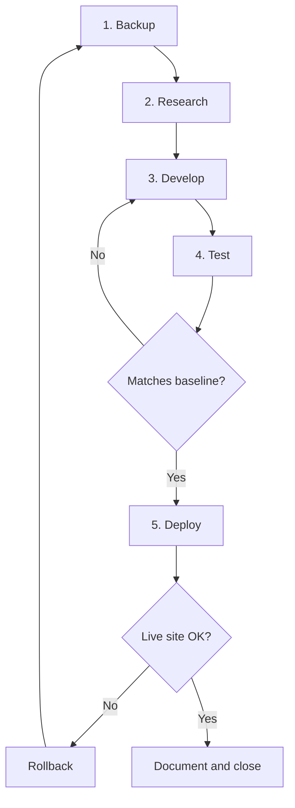

# Workflow

The standard process for making any change that could affect the live site.
Every change follows these five stages in order.

## Process Overview

## 1. Backup

- Confirm a current, verified backup exists (see
  [Backup Strategy](BACKUP_STRATEGY.md)).
- For significant changes, create a fresh pre-change backup under `00_Backups/`.

## 2. Research

- Review the relevant audit reports and baseline screenshots.
- Confirm the change is in scope (see [Project Overview](PROJECT_OVERVIEW.md)).
- Note the approach and any risks.

## 3. Develop

- Implement changes in the **Ave child theme** or as custom CSS/JS/PHP under
  `03_Development/`.
- Never edit the parent theme or plugin files directly.
- Follow the [Coding Standards](CODING_STANDARDS.md).

## 4. Test

- Capture comparison screenshots under `04_Testing/`.
- Compare against the baselines in `04_Testing/Baseline/`.
- Check desktop and mobile; clear caches (WP Rocket) before testing.

## 5. Deploy

- Follow the [Deployment Checklist](../05_Deployment/DEPLOYMENT_CHECKLIST.md).
- Verify the live site after deployment.
- Record the change in the [Changelog](../CHANGELOG.md) and
  [Development Log](DEVELOPMENT_LOG.md).
- If anything fails, use the
  [Rollback Checklist](../05_Deployment/ROLLBACK_CHECKLIST.md).

## Version Control

- Work on a branch per change; keep commits focused and descriptive.
- Never commit backup archives (`00_Backups/` is git-ignored).
- Update documentation in the same change that introduces the work.
